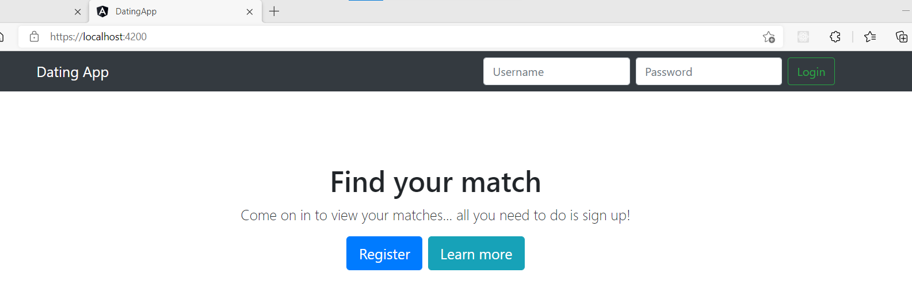

## 04 Authentication Basics

Objectives:

- Update the User entity adding two properties, Password Hash and Password Salt. (byte[])
- Migrate the database.
- Create a controller for login and register.
- Add validation to reject null values for the username or password.
- Add a token service.
- Create token login.
- Add the Authentication middleware.
- Add Extension method.

Hints:

```csharp
using System.Security.Cryptography;
using System.Text;

using var hmac = new HMACSHA512();
AppUser user = new AppUser()
{
    UserName = registerDto.UserName.ToLower(),
    PasswordHash = hmac.ComputeHash(Encoding.UTF8.GetBytes(registerDto.Password)),
    PasswordSalt = hmac.Key
};
```

#### Add a token service

```csharp
public void ConfigureServices(IServiceCollection services)
{
    services.AddScoped<ITokenService, TokenService>();
    //...
}

// Package: System.IdentityModel.Token.Jwt
public class TokenService : ITokenService
{
    private readonly SymmetricSecurityKey _key;
    public TokenService(IConfiguration config)
    {
        _key = new SymmetricSecurityKey(Encoding.UTF8.GetBytes(config["TokenKey"]));
    }
    public string CreateToken(AppUser user)
    {
        var claims = new List<Claim>
        {
            new Claim(JwtRegisteredClaimNames.NameId, user.UserName)
        };

        var creds = new SigningCredentials(_key, SecurityAlgorithms.HmacSha512Signature);

        var tokenDiscriptor = new SecurityTokenDescriptor
        {
            Subject = new ClaimsIdentity(claims),
            Expires = DateTime.Now.AddDays(7),
            SigningCredentials = creds
        };

        var tokenHandler = new JwtSecurityTokenHandler();
        var token = tokenHandler.CreateToken(tokenDiscriptor);

        return tokenHandler.WriteToken(token);
    }
}
```

#### Authentication Middleware

```csharp
// Package: Microsoft.AspNetCore.Authentication.JwtBearer by Microsoft
// startup.cs
services.AddAuthentication(JwtBearerDefaults.AuthenticationScheme)
    .AddJwtBearer(options =>
                  {
                      options.TokenValidationParameters = new Microsoft.IdentityModel.Tokens.TokenValidationParameters
                      {
                          ValidateIssuerSigningKey = true,
                          IssuerSigningKey = new SymmetricSecurityKey(Encoding.UTF8.GetBytes(_config["TokenKey"])),
                          ValidateIssuer = false,
                          ValidateAudience = false
                      };
                  });
```

## 05 Client Login and Register

Objectives:

- Create a navbar component.
- Copy a navbar template from the bootstrap website.
- Import Forms Module and bind form inputs with an object.
- Angular Services, account service.
- Using conditions to show and hide content. (logged in)
- Dropdown functions, check it from the ngx-bootstrap website.
- Add a type of User.
- Create an observable in the account service.
- Async Pipe.
- A Home Page.
- Register function.

#### Angular Form

Two way binding

```
<form #loginForm="ngForm" (ngSubmit)="login()" autocomplete="off">
    <input name="username" [(ngModel)]="model.username" />
    <button type="submit">Login</button>
</form>
```

#### Angular Service

```bash
ng g s account --skip-tests
```

Inject Http Client into the service. Create a login method which posts the model to the API and receive a user.

#### Login and Logout

Fulfill the Login and Logout function with localstorage.

#### Home Page



After click the Register button the form area will show.


#### Register Form

Create a component for the Register Form. It does not submit anything to the server at this stage.

#### Components Communication

Getting a list of users is moved from App to Home. Pass data down from the Home component to the Register component.
