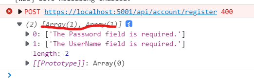
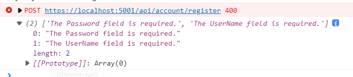

## Error Handling

#### Objectives

- Create an error controller for testing (Buggy Controller).
- Exception handling middleware.


#### Middleware


```csharp
public class ExceptionMiddleware
{
    readonly RequestDelegate _next;
    readonly ILogger<ExceptionMiddleware> _logger;
    readonly IHostEnvironment _env;
    public ExceptionMiddleware(RequestDelegate next,
                               ILogger<ExceptionMiddleware> logger, IHostEnvironment env)
    {
        _next = next;
        _logger = logger;
        _env = env;
    }

    public async Task InvokeAsync(HttpContext context)
    {
        try
        {
            await _next(context);
        }
        catch(Exception ex)
        {
            _logger.LogError(ex, ex.Message);
            context.Response.ContentType = "application/json";
            context.Response.StatusCode = (int)HttpStatusCode.InternalServerError;

            var response = _env.IsDevelopment()
                ? new ApiException(context.Response.StatusCode, ex.Message, ex.StackTrace?.ToString())
                : new ApiException(context.Response.StatusCode, "Internal Server Error");

            var options = new JsonSerializerOptions { PropertyNamingPolicy = JsonNamingPolicy.CamelCase };
            var json = JsonSerializer.Serialize(response, options);

            await context.Response.WriteAsync(json);
        }
    }
}

// start.cs
app.UseMiddleware<ExceptionMiddleware>();
```


#### Errors in the client

```ng g interceptor error --skip-tests```


```typescript
// error.interceptor.ts
export class ErrorInterceptor implements HttpInterceptor {

  constructor(private router:Router, private toastr:ToastrService) {}

  intercept(request: HttpRequest<unknown>, next: HttpHandler): Observable<HttpEvent<unknown>> {
    return next.handle(request).pipe(
      catchError(error => {
        if(error){
          switch(error.status){
            case 400:
              if(error.error.errors){
                const modalStateErrors = [];
                for(const key in error.error.errors){
                  if(error.error.errors[key]){
                    modalStateErrors.push(error.error.errors[key]);
                  }
                }
                throw modalStateErrors;
              } else {
                this.toastr.error("Bad Request", error.status);
              }
              break;
            case 401:
              this.toastr.error("401 error", error.status);
              break;
            case 404:
              this.router.navigateByUrl('/not-found');
              break;
            case 500:
              const navigationExtras: NavigationExtras = {state: {error: error.error}};
              this.router.navigateByUrl('server-error', navigationExtras);
              break;
            default:
              this.toastr.error('Something unexpected went wrong');
              console.log(error);
              break;
          }
        }
        return throwError(error);
      })
    );
  }
}

// app.modules.ts
providers: [
    {provide: HTTP_INTERCEPTORS, useClass: ErrorInterceptor, multi: true }
],
// multi: true, so we do not overwrite any existing provider.
```


#### Validation Error

```json
/* tsconfig.json */
/* add es2019 */
"lib": [
    "es2019",
    "es2018",
    "dom"
]

```


Then we can use some new features in ES2019.

```typescript
// error.interceptor.ts
// replace
throw modalStateErrors;
// with
throw modalStateErrors.flat();
```

Before:



After:



Then we can remove the error handling in the login method of navbar component.
