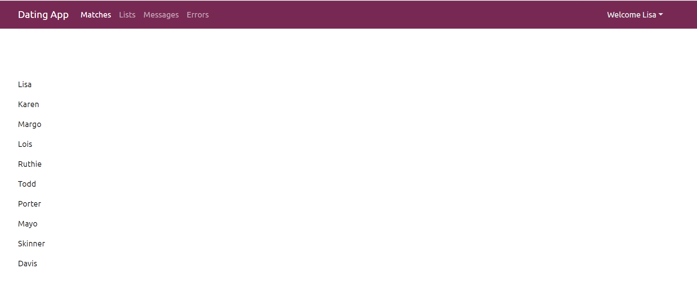

## UI

#### Interfaces

```json
export interface Photo {
    id: number;
    url: string;
    isMain: boolean;
}

import { Photo } from './photo';

export interface RootObject {
    id: number;
    userName: string;
    age: number;
    knownAs: string;
    photoUrl: string;
    created: Date;
    lastActive: Date;
    gender: string;
    introduction: string;
    lookingFor: string;
    interests: string;
    city: string;
    country: string;
    photos: Photo[];
}
```


#### Environment

```typescript
// environment.ts
export const environment = {
  production: false,
  apiUrl: 'https://localhost:5001/api/'
};

// environment.prod.ts
// when we publishi this app, it will be inside the ASP.Net core project
export const environment = {
  production: true,
  apiUrl: 'api/'
};

// acount.service.ts
baseUrl = environment.apiUrl;
```


#### Send Token

```typescript
// member.service.ts
import { HttpClient, HttpHeaders } from '@angular/common/http';
import { Injectable } from '@angular/core';
import { environment } from 'src/environments/environment';
import { Member } from '../_models/member';

const httpOptions = {
  headers: new HttpHeaders({
    Authorization: 'Bearer ' + JSON.parse(localStorage.getItem('user')).token
  })
}

@Injectable({
  providedIn: 'root'
})
export class MembersService {
  baseUrl = environment.apiUrl;

  constructor(private http: HttpClient) { }

  getMembers(){
    return this.http.get<Member[]>(this.baseUrl + 'users', httpOptions);
  }
}

// member-list
export class MemberListComponent implements OnInit {
  members: Member[] = [];

  constructor(private memberService: MembersService) { }

  ngOnInit(): void {
    this.loadMembers();
  }

  loadMembers(){
    this.memberService.getMembers().subscribe(members => {
      this.members = members;
    })
  }
}
```


```html
<!-- member-list -->
<!-- test getting members -->
<div class="row">
    <div class="col-2">
        <p *ngFor="let member of members">{{member.knownAs}}</p>
    </div>
</div>
```




#### Some CSS

```css
.card:hover img {
    transform: scale(1.2, 1.2);
    transition-duration: 500ms;
    transition-timing-function: ease-out;
    opacity: 0.7;
}

.card img{
    transform: scale(1.0, 1.0);
    transition-duration: 500ms;
    transition-timing-function: ease-out;
}

.card-img-wrapper {
    overflow: hidden;
} // prevent the image out of the area
```


#### Using Interceptor to send token

```typescript
// jwt.interceptor.ts
@Injectable()
export class JwtInterceptor implements HttpInterceptor {

  constructor(private accountService: AccountService) {}

  intercept(request: HttpRequest<unknown>, next: HttpHandler): Observable<HttpEvent<unknown>> {
    let currentUser: User;

    this.accountService.currentUser$.pipe(take(1)).subscribe(user => {
      currentUser = user;
    })

    if(currentUser){
      request = request.clone({
        setHeaders: {
          Authorization: `Bearer ${currentUser.token}`
        }
      })
    }
    return next.handle(request);
  }
}

// app.module.ts
  providers: [
    {provide: HTTP_INTERCEPTORS, useClass: ErrorInterceptor, multi: true },
    {provide: HTTP_INTERCEPTORS, useClass: JwtInterceptor, multi: true }
  ],
// delete the httpOptions from the members.service.ts
```


#### Member Detail

```typescript
export class MemberDetailComponent implements OnInit {
  member: Member;

  constructor(private memberService: MembersService, private route: ActivatedRoute) { }

  ngOnInit(): void {
    this.loadMember();
  }

  loadMember(){
    this.memberService.getMember(this.route.snapshot.paramMap.get('username')).subscribe(member => {
      this.member = member;
    })
  }
}
```


Import Tabs Module from ngx-bootstrap.

```html
<div class="row" *ngIf="member">
    <div class="col-4">
        <div class="card">
            
            <div class="card-body">
                <div>
                    <strong>Location:</strong>
                    <p>{{member.city}}, {{member.country}}</p>
                </div>
                <div>
                    <strong>Age:</strong>
                    <p>{{member.age}}</p>
                </div>
                <div>
                    <strong>Member since:</strong>
                    <p>{{member.created}}</p>
                </div>
                <div>
                    <strong>Last Active:</strong>
                    <p>{{member.lastActive}}</p>
                </div>
            </div>
            <div class="card-footer">
                <div class="btn-group d-flex">
                    <button class="btn btn-primary">Like</button>
                    <button class="btn btn-success">Message</button>
                </div>
            </div>
        </div>
    </div>

    <div class="col-8">
        <tabset class="member-tabset">
            <tab heading="About {{member.knownAs}}">
                <h4>Description</h4>
                <p>{{member.introduction}}</p>
                <h4>Looking for</h4>
                <p>{{member.lookingFor}}</p>
            </tab>
            <tab heading="Interest">
                <h4>Interests</h4>
                <p>{{member.interests}}</p>
            </tab>
            <tab heading="Photos">
                <p>Photos will go here</p>
            </tab>
            <tab heading="Messages">
                <p>Messages will go here</p>
            </tab>
        </tabset>
    </div>
</div>
```


#### Photo Gallery

