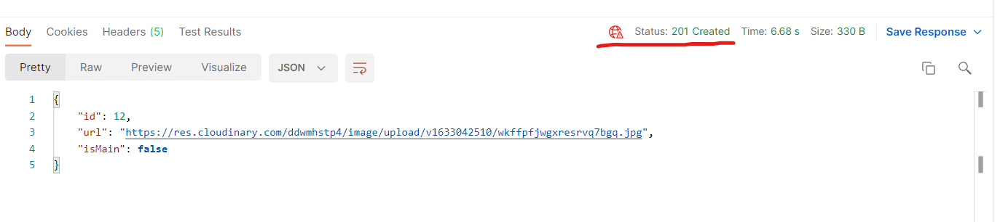

## Uploading Photos

Install CloudinaryDotNet package.

Strongly type a configuration.

#### Return 201 Created

```csharp
if(await _userRepository.SaveAllAsync())
{
    //return _mapper.Map<PhotoDto>(photo);
    return CreatedAtRoute("GetUserByUsername", new { username = user.UserName }, _mapper.Map<PhotoDto>(photo));
}

[HttpGet("username/{username}", Name = "GetUserByUsername")]
public async Task<ActionResult<MemberDto>> GetUserByUsername(string username)
{
    // ...
}
```



#### Adding a photo uploader
