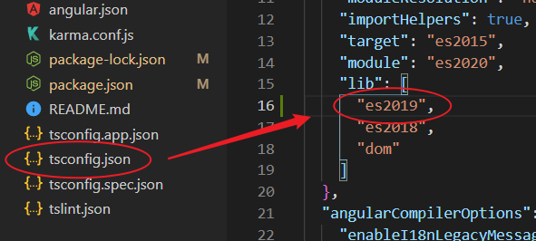
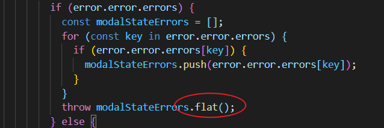
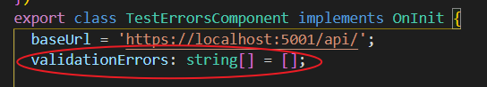
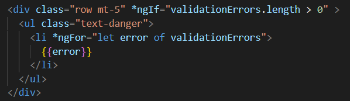
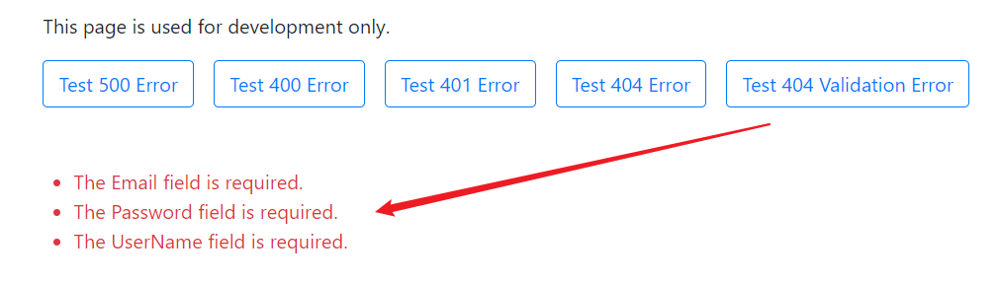

#### Angular Services

A typical service:

```typescript
//ng g s serviceName --skip-test
import { HttpClient } from '@angular/common/http';
import { Injectable } from '@angular/core';

@Injectable({
  providedIn: 'root'
})
export class AccountService {
  baseUrl = 'https://localhost:5001/api/';

  constructor(private http: HttpClient) { }

  login(model: any){
    return this.http.post(this.baseUrl + 'accounts/login', model);
  }
}
```

#### Errors Handling



Then we can use this:



An array for handling errors:



Get those error information out in the template:



The results:



Add not found and serve