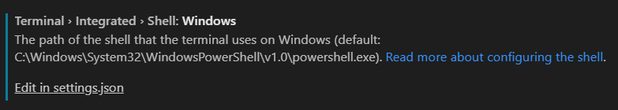

#### Software

Node.js

VS Code

git

Augury (Chrome Extension)

#### VS Code Extensions

**Angular Snippets** by John Papa

**Bracket Pair Colorizer 2** by CoenraadS

Use lorem to get Radom words.

#### VS Code Configuration

Change the termina

File > Preference > Setting

Search 'terminal' and find this:



Click 'Edit in settings.json':

```json
{
    "terminal.integrated.shell.windows": "D:\\Program Files\\Git\\bin\\bash.exe"
}
```

#### First App

```javascript
npm install -g @angular/cli
ng new my-app
cd my-app
ng serve --open
```

#### File Structure

The start point is main.ts. 