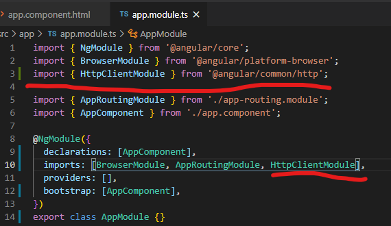

#### Make HTTP Requests



```typescript
constructor(private http: HttpClient) {}

login(model: any) {
    return this.http.post(this.baseUrl + 'accounts/login', model).pipe(
        map((response: User) => {
            const user = response;
            if (user) {
                localStorage.setItem('user', JSON.stringify(user));
                this.currentUserSource.next(user);
            }
        })
    );
}
```

#### CORS support

Startup.cs


