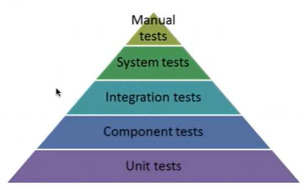
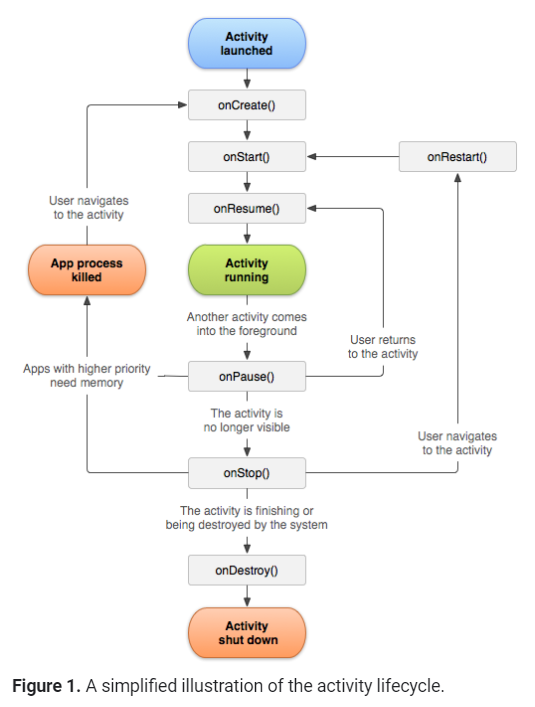

#### What is automated testing

Automation Testing is a software testing technique which executes tests by automated testing software tools.


#### 自动化测试有哪些优势？

There are four major advantages.

First one is it frees up the tester's time.

Then it could increase the confidence. When all automated checks in a test suite pass, we know the application works well basically.

Next one is it is efficient. For the full regression testing, automation test can be running at night, and the project team can get the testing feedback next day morning.

The last one is testers could get a feedback quickly. By an automated smoke testing, the tester could quickly know the application is prepared for more testing.

> efficient  / iˈfiʃnt / **adj.**
>
> confidence  /ˈkɔnfidəns /


#### 自动化测试有哪些劣势？

There are five major disadvantages.

Firstly, the test scripts need to be developed. Sometimes, it is time consuming.

Then, it will create false sense of quality. There could be major flaws undetected, because it cannot look for those failures, such as UI issue.

It may be not reliable, because for the code changes, UI changes, and different environments.

Testers will need to spend the time upgrading the relevant tests as the application is upgraded.

The last one is that it cannot find many bugs. For example, the automated regression test always follow a given path and even the same set of test data. It reduces the chance of finding new defects in the application.

> consume  / kənˈsjuːm / **VN**
>
> sense  / sens /
>
> flaw  /flɔː/
>
> reliable  / riˈlaiəbl / **adj.** 
>
> relevant  / ˈreləvənt / 


Test types suitable for automated tessting are: Regression Testing, Smoke Testing, Basic Acceptance Testing, Reliability Testing, Stress Test.

The types of testing are not suitable for automated testing are: exploratory testing, user experience testing, and look and feel testing.


#### Testing Pyramid




#### What is Espresso

Espresso is a testing framework for Android to make it easy to write reliable user interface tests.

Espresso automatically synchronises your test actions with the user interface of your application. The framework also ensures that your activity is started before the tests run. It also let the test wait until all observed background activities have finished.

它会等待系统反应。

+ Simulate User Interactions
+ Automatic synchronisation of test actions with App UI

Espresso takes care of synchronisation with the UI events so that, in most cases, you don't have to worry about any view state transition.


#### JUnitRunner

40:00

```AndroidJUnitRunner``` is a new unbundled test runner for Android, which is part of the Android Testing Support Library and can be downloaded via the Android Support Repository.

Here are some of the most common features:

+ JUnit4 support
+ Instrumentation Registry
+ Test Filters
+ Test timeouts
+ Sharding of tests
+ RunListener support to hook into the test run life-cycle
+ Activity and Application life-cycle monitoring
+ Intent Monitoring and Stubbing


#### JUnit4 Rules

JUnit rules 测试前和测试后需要做的事情。

With the Android Testing Support Library (ATSL) we are providing a set of JUnit rules to be used with the ```AndroidJUnitRunner```. JUnit rules provide more flexibility and reduce the boilerplate code required in tests.


#### App Life Cycle




#### General Testing Process

**Manual Testing**

1. Find the UI Elements
2. Perform an action
3. Check the App's response

**Automation Testing**

1. OnView
2. Perform
3. Check


