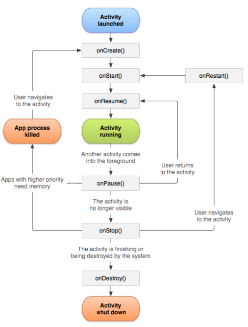

#### 旧版配置

+ Java JDK 1.8
+ Android Studio 3.2.1
+ Android SDK API Level 25

注意打开旧版项目，不要更新。

#### 新版配置

+ Java JDK 1.8
+ Android Studio 4.0.1
+ Android SDK API Level 29

#### Basic Work Flow:

+ Create UI Layout
+ Dependency Set Up
+ Implement UI elements and App's functionalities
+ App Configuration Settings

#### Basic for Creating Android App

Manifests folder -> AndroidManifest.xml

包括了一个 intent-filter，及其下包括 action 和 category。

#### Activity Life Cycle



#### First Test

```java
@RunWith(AndroidJUnit4.class)
public class ExampleInstrumentedTest {
    @Rule
    public ActivityTestRule<MainActivity> activityTestRule = new ActivityTestRule(MainActivity.class, true, true);
    @Test
    public void firstTest() throws Exception {
        onView(withId(R.id.button)).perform(click());
        onView(withText("testHelloWorld")).check(matches(isDisplayed()));
    }
}
```

