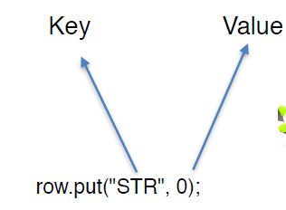

+ Spinner View
+ List View
+ Automating Spinner & List View
+ Hamcrest Matcher


#### Spinner

```java
public class MainActivity extends AppCompatActivity implements AdapterView.OnItemSelectedListener {
    private  Spinner spinner;
}
// onCreate mehtod
// Spinner element
spinner = (Spinner) findViewById(R.id.spinner);

// Spinner click listener
spinner.setOnItemSelectedListener(this);

// Spinner Drop down elements
List<String> categories = new ArrayList<>();

categories.add("Item1");
categories.add("Item2");
categories.add("Item3");
categories.add("Item4");
// ...

// Creating adapter for spinner
ArrayAdapter<String> dataAdapter =
    new ArrayAdapter<>(this,android.R.layout.simple_spinner_item,categories);

// Drop down layout style - list view with radio button
dataAdapter.setDropDownViewResource(android.R.layout.simple_spinner_dropdown_item);

// attaching data adapter to spinner
spinner.setAdapter(dataAdapter);

@Override
public void onItemSelected(AdapterView<?> parent, View view, int position, long id) {
    // On selecting a spinner item
    String item = parent.getItemAtPosition(position).toString();

    // Showing selected spinner item
    Toast.makeText(parent.getContext(), "Position : " + position + " Selected: " + item, Toast.LENGTH_LONG).show();

}
```


#### On Data

```java
onView(withText("Item8")).perform(swipeUp());
onData(is("Item20")).perform(click());
// Map
onData(hasKey("STR"));
onData(hasValue(0));
onData(hasEntry(is("LEN"), is(7)));
onData(anything())
    .atPosition(0)
    .onChildView(withId(R.id.item_content))  // Map 第 n 列，每列对应一个 view 有 id
    .perform(click());
```





#### List View

```java
onView(withText("ListView Item8")).perform(swipeUp());
onData(is("ListView Item15")).perform(click());
// Data Option
onData(is("ListView Item1")).atPosition(1).perform(click());
onData(is("ListView Item1"))
    .inAdapterView(withId(R.id.spinner2))
    .perform(click());
```


#### Limit of On View

只有当前显示的元素才能被找到。

It only search elements that it finds on the current screen.


#### Questions

**When should use on Data?**

When working with Adapter Views. On data supply a Matcher that will try to match a row in the Adapter. If there is a successful match, Espresso will then bring that row onto the screen and into the view hierarchy so that we can perform actions and check assertions on its vies as usual.

**on data VS on View**

On data creates an Data Interaction / On view creates a View Interaction.

data matcher / view matcher

We are passing a Matcher that works with data supply by the Adapter instead of a Matcher which looks for View attributes.