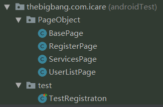

#### Page Object

Why we need Page Object?

Firstly, it separates the behaviours of pages from the test steps.

When any UI changed, we have to changed the code in multiple places.


**Page Navigating**

Every Page object inherited from a Base Page. Use Base Page as a container to navigate through Page Object.

```java
BasePage basePage = new LoginPage();

((LoginPage)basePage).fillProfile();
basePage = ((LoginPage)basePage).clickSave();
```


**实例**



One folder is used for all Page Objects including Base Page. One folder is used for all tests.


```java
// Navigation
public RegisterPage createNewProfile(){
    onView(withId(R.id.tvAddNew)).perform(click());
    return new RegisterPage();
}

// text view
onView(withId(R.id.etName)).perform(typeText("Burger"));
closeSoftKeyboard();

// date picker
onView(withId(R.id.etDateofBirth)).perform(click());
onView(withClassName(is(DatePicker.class.getName()))).perform(PickerActions.setDate(1984, 4, 29));
onView(withText("OK")).perform(click());

// radio button
onView(withId(R.id.rbMale)).perform(click());

// spinner view
onView(withId(R.id.spBloodGroup)).perform(click());
onData(is("B+")).perform(click());

// Test steps
@Test
public void loginTest() throws Exception{
    Thread.sleep(8000);
    BasePage basePage = new UserListPage();

    basePage = ((UserListPage)basePage).createNewProfile();
    ((RegisterPage)basePage).fillForm();
    basePage = ((RegisterPage)basePage).saveForm();
    Thread.sleep(1000);
    basePage = ((UserListPage)basePage).clickUser();
    basePage = ((ServicesPage)basePage).backToUserListPage();

}
```


#### BDD

Behaviour Driven Testing


