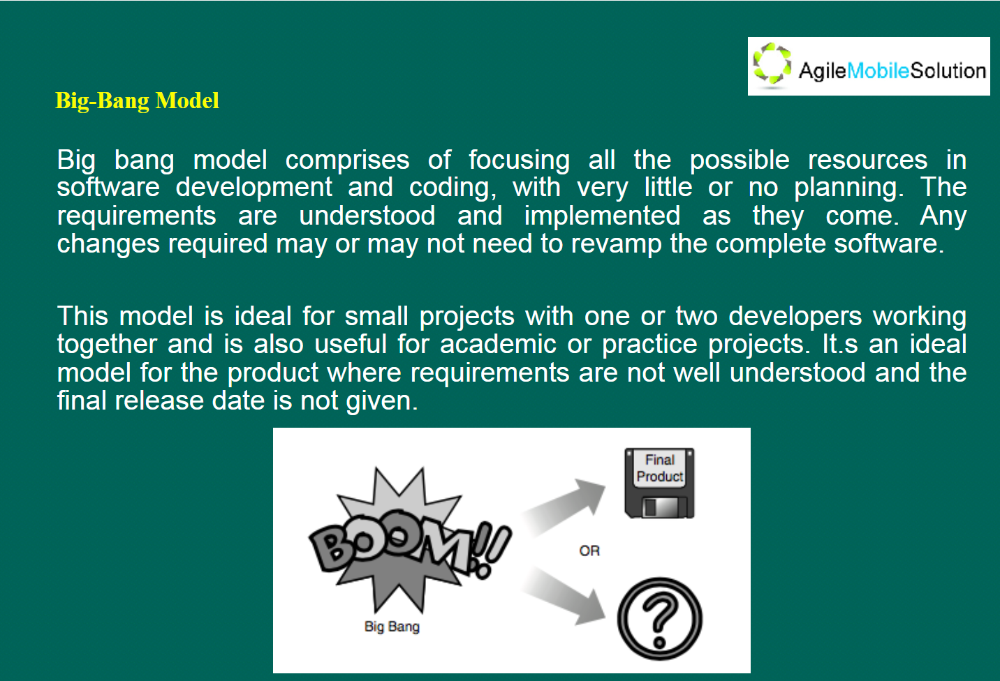
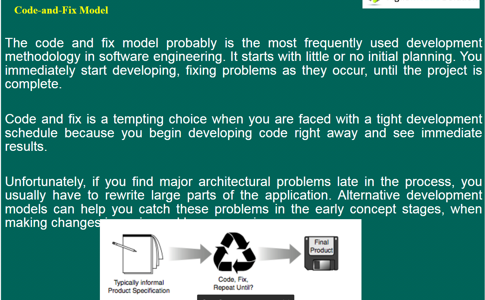

## Software Developing Life Cycle Methodologies

#### Big-Bang Model

Test project or very small project. There are only few developers.

#### Code-and-Fix Model

When a tight development schedule, want to see immediate results.

#### Waterfall Model

#### V-Shaped Model

#### V-Model: late test design

#### W-Model: early test design

## Interview Questions

1. 什么是软件的开发周期？

   The systems development life cycle (SDLC) is a term used in systems engineering, information systems and software engineering to describe a process for planning, creating, testing, and deploying an information system.

2. 请解释什么叫做瀑布模型？17

   The waterfall model is a linear sequential flow. In which progress is seen as flowing steadily downwards through the phases of software implementation. This means that any phase in the development process begins only if the previous phase is complete.

3. 瀑布模型有什么优缺点？

   There are some major advantages to the waterfall model.

   Firstly, it is easy to explain to users. It is clear that how many phases and how many activities in each phase.

   Then it is structure approach.

   Next one is that stages and activities are well defined. So, everyone in the group knows what to do.

   It also can help to plan and schedule the project. Because activities are well defined.

   Then there is verification at each stage ensures early detection of errors or misunderstanding.

   The last one is that each phase has specific deliverable.

   On the other hand, there are some disadvantages.

   It assumes that the requirements of a system can be frozen. So it is very difficult to go back to any stage after it finished. And little flexibility and adjusting scope is difficult and expensive.

   The last one is that it is costly and required more time, when something have to add to the detailed plan.

4. V 模型的缺点有哪些？

   There are some disadvantages of V-Shaped Model.

   It is also very inflexible, like the waterfall model. And little flexibility and adjusting scope is difficult and expensive.

   Software is developed during the implementation phase, so no early prototypes of the software are produced.

   It doesn't provide a clear path for problems found during testing phases.

   It is costly and required more time, when something have to add to the detailed plan.

   The last one is that there is no time to design tests early.

5. 相比 V 模型，W 模型的优势在哪里？

   It helps in ensuring that the testing of the product begins from the first day of the product's development. So, when any problem is found by testing, it is easy to fix it at that phase. It helps in ensuring that each phase of the product development is verified and validated before next phase.

6. 请解释什么叫做敏捷模型？

   Agile Model breaks the product into small incremental builds. These builds are provided in iterations. Each build should be confirmed with clients to ensure it is what clients wanted.