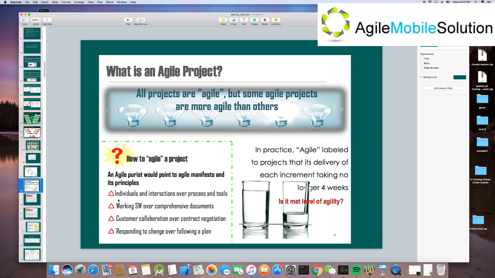
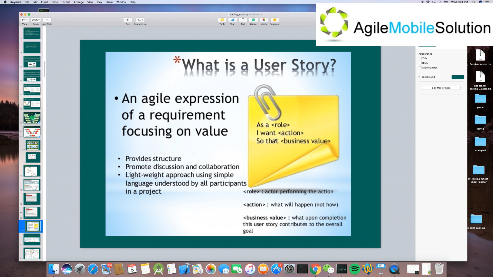
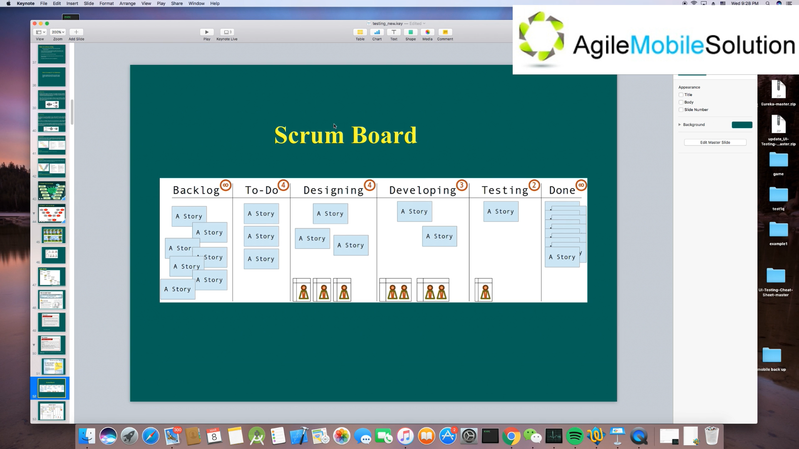
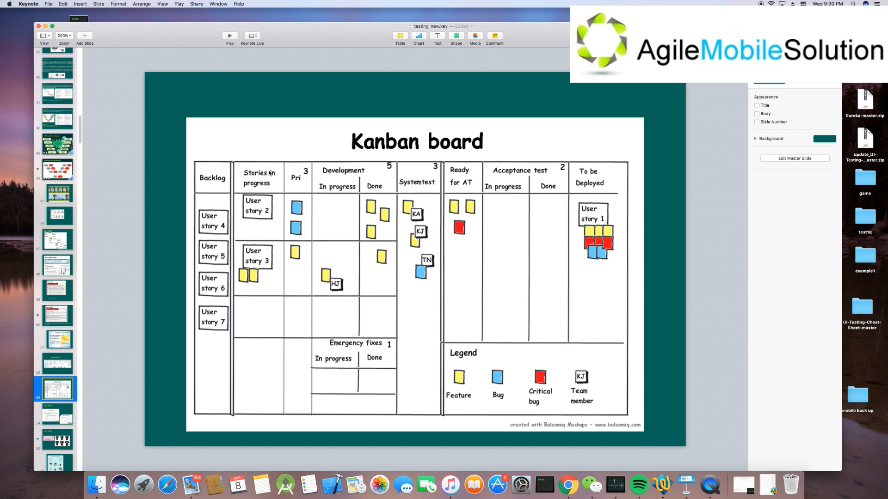
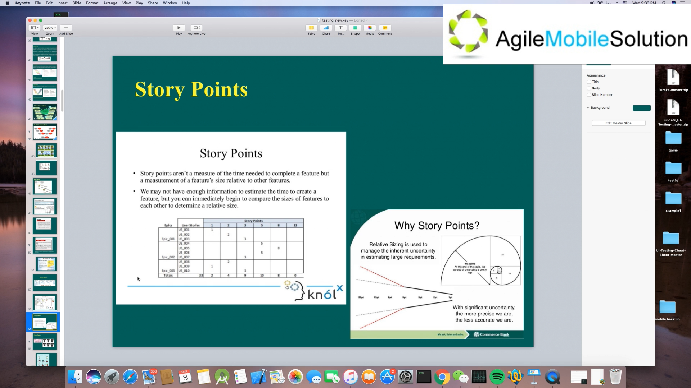
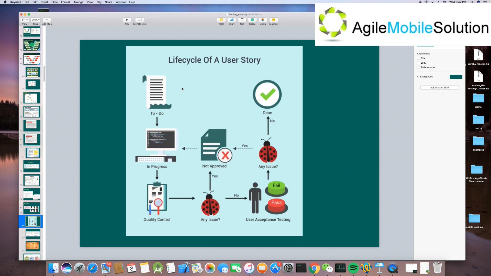
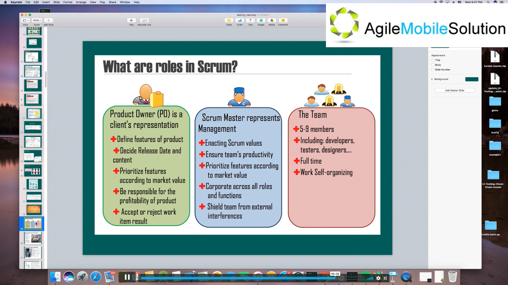
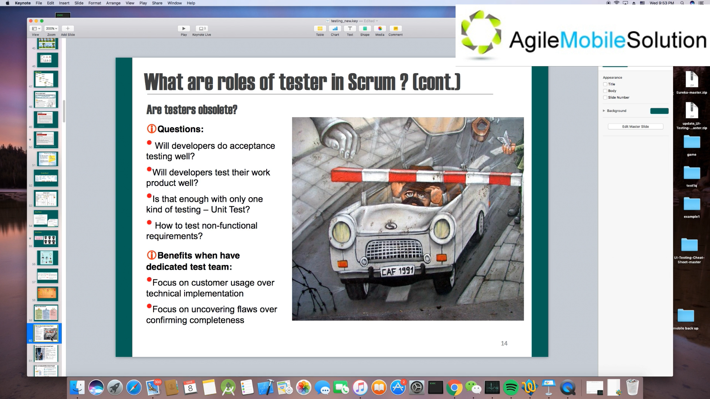

## 讲课

#### Agile Model

敏捷宣言：

+ 注重人员的沟通
+ 针对软件开发而不是针对文档来开展工作，软件更改涉及到很多文档更改
+ 靠合作而不是完全靠合同来把项目做好
+ 积极相应变化

#### What is Scrum? (10 mins)

+ Scrum is an agile process that allows us to / 一般是 2 周，最长不会超过 4 周
+ It allows us to rapidly and repeatedly inspect actual
+ The business sets the priorities
+ Every two weeks to a month anyone can see real working software and decide to release it as is or continue to enhance it for another sprint.

#### Kanban

**Visualize the workflow**

Split the work into pieces, write each item on a card and put on the wall.

Use named columns to illustrate where each item is in the workflow.

**Limit Work In Progress (WIP)** - assign 

**Measure the lead time** (average time to complete one item, sometimes called "cycle time"), optimize the process to make lead time as small and predicable as possible

Kanban does not care too much about the time, but care about

#### What is a User Story? (24 mins)

#### Scrum Board (27 mins)

Backlog - User Story 信息收集好了放到 to-do

关注制定的时间段里，需要完成承若的 user story。

#### Kanban Board

开发，测试，接收性测试，可以部署。

关注在某个时间范围里面，完成 User Stories 的数量。

#### Story Points

对复杂度进行评估。可以用已完成的一个用户场景，主观地预估将要完成的场景。不是工作量的具体体现。

目的，保证大家对复杂度的意见是一致的。当出现较大差异，通过相互解释，使得所有人理解一致。

#### Lifecycle Of A User Story

准备开始，然后到写代码，再到质量控制，再到用户接收性测试，如果这两个步骤中找出 bug 再回到写代码，直到都通过后标记完成。

#### What are roles in Scrum?

 Scrum Master 带领一个团队的人员。

#### Next?

## 面试题

1. 请描述 Story Points 的用途

   Story points are a measurement of a feature's complexity and size relative to other features. It is used to ensure everyone in the team has the same understanding of the feature's complexity. And the relative sizing is used to manage the inherent uncertainty in estimating large requirements.

2. 请描述 User Story 的生命周期

   The initial stage of a task in a user story is To Do. At this stage, the requirements are framed in the simplest form.

   Next stage is In Progress. The actual development or design work begins here.

   Then the User story goes for a quality check before being submitted for an acceptance testing or being moved on to the state of "completion". If any defects reported, the changes are referred back to the team and the User Story goes back to In Progress stage.

3. 在一个 Scrum team 里，会有哪些人员角色？

   There are 3 roles in a Scrum team, Product Owner, Scrum Master and Team Member.

   Product owner is a client's representation. He define features of product and prioritize features according to market value. He also has the right to accept or reject work item result.

   Scrum master is a team leader. He remove impediments, facilitate meetings and work with product owner.

   There are 5-9 members in a team. They are full time and can work independently.

#### More reference

https://www.netsolutions.com/insights/what-is-user-story-lifecycle-and-why-it-is-so-crucial-in-ensuring-a-succesful-project-delivery/