##  讲课

#### What are roles of tester in Scrum?

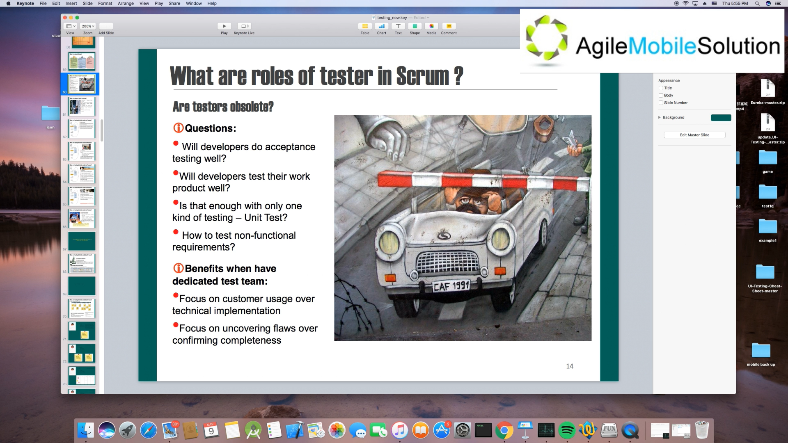

#### What are roles of tester in Scrum? (10 mins)

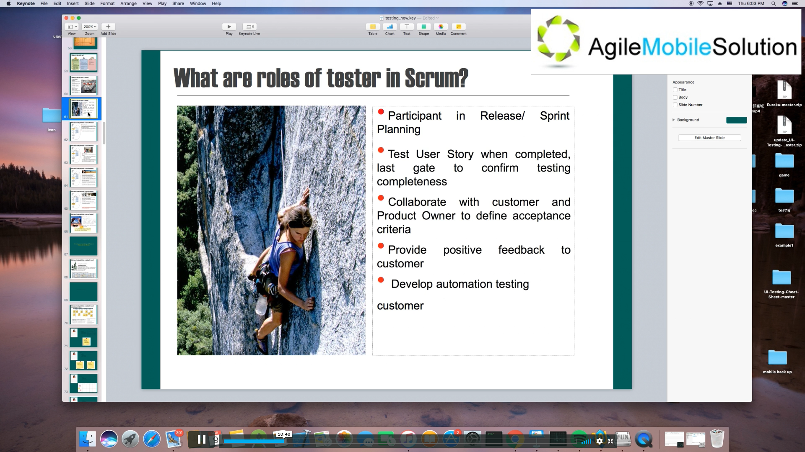

#### What are Testing Activities in Scrum Process (14 mins)

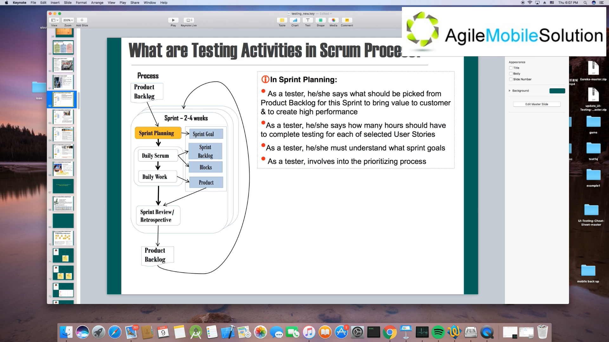

(21 mins)

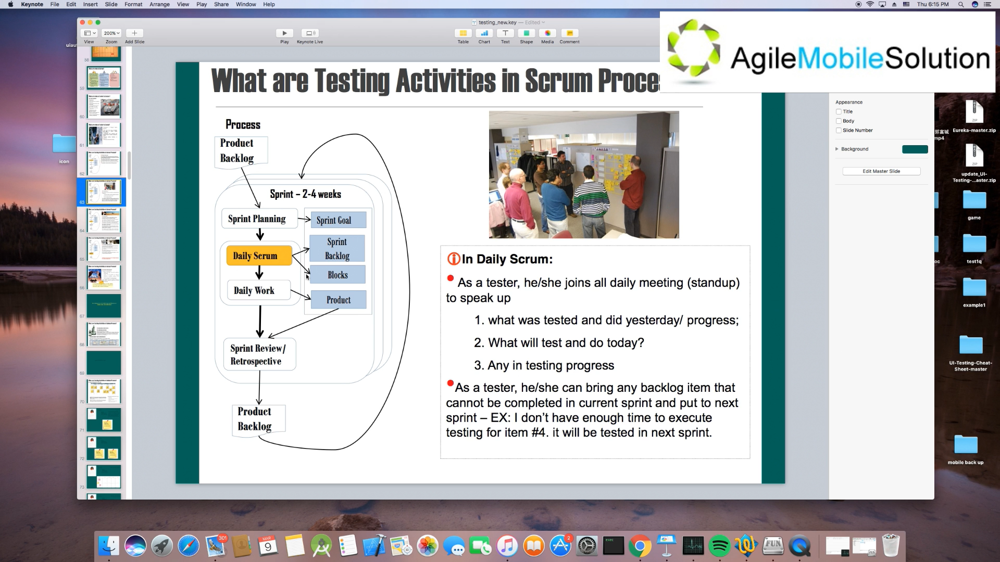

daily work

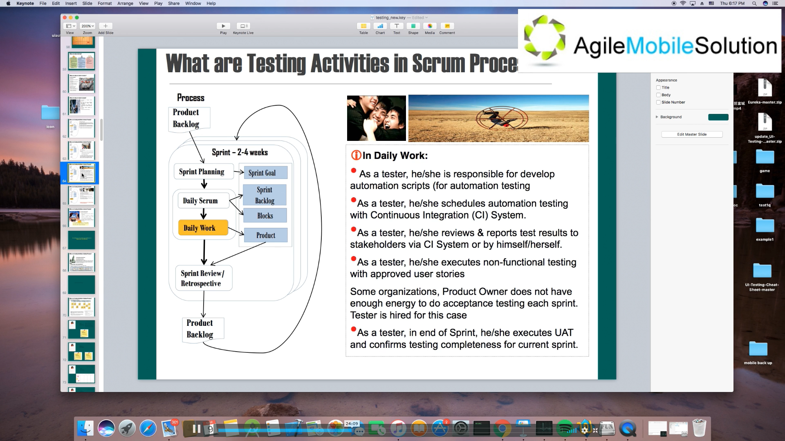

Review

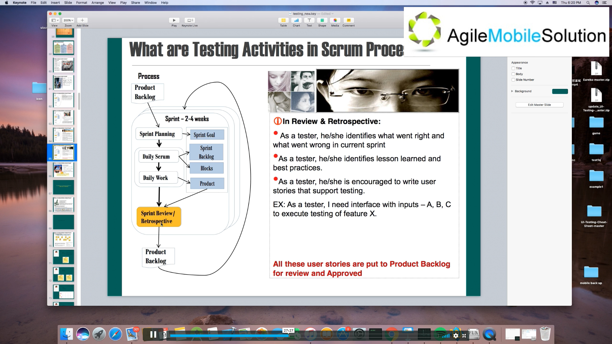

流程上或者工作上有没有什么地方可以改进？有哪些地方做的好的？

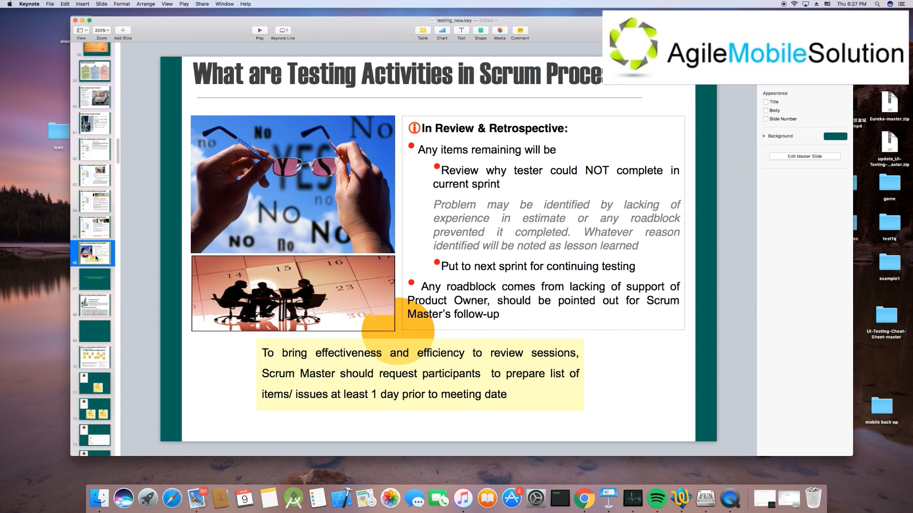

Scrum Master 的一个职责保证团队成员保持高效工作。

#### Kanban 的流程

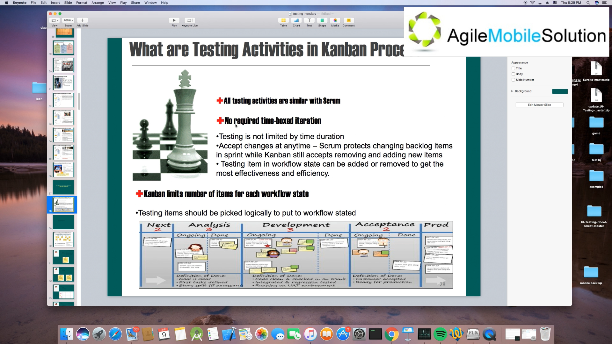

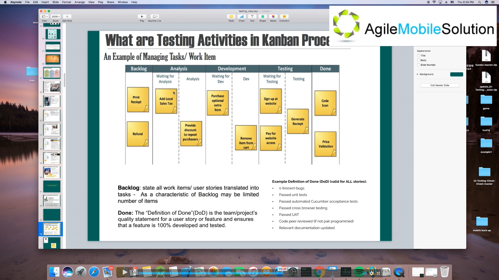

刚开始，什么都没做就是 backlog，然后分析，写 user stories .. 然后开发，测试，交付。

#### User Story for Login

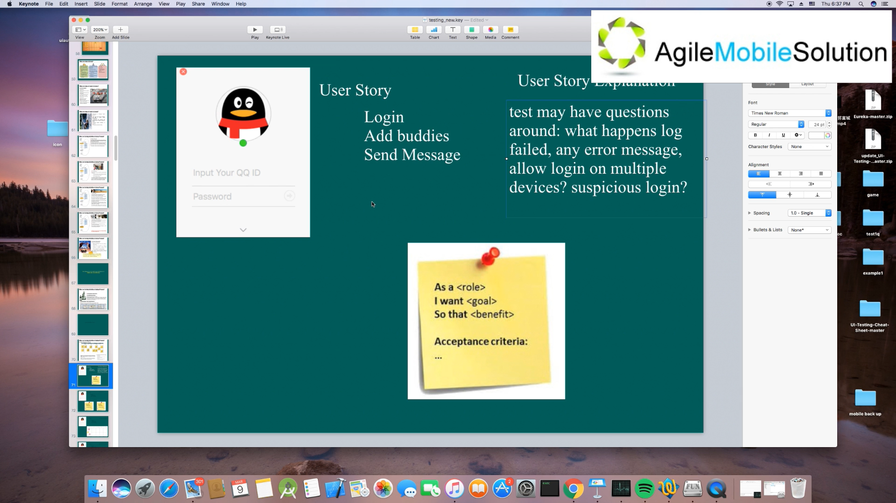

定义后大家一起评估它的大小，太大的话可能需要拆分，然后放到看板里。

#### What are documents of testing in Agile Project (53 mins)

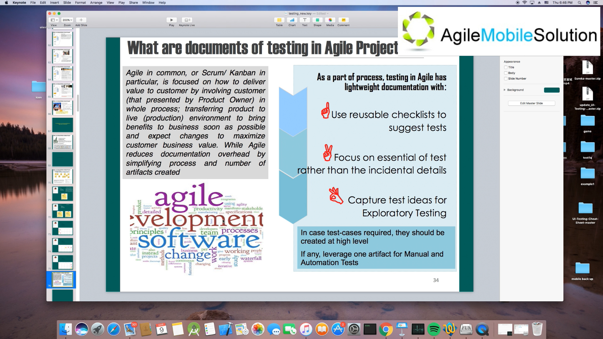

## 面试题

1. 结合上节课的内容请描述敏捷中的 Scrum 流程

   Firstly, user stories are prepared and put into logback.

   Next step is sprint planning, the scrum team should decide which user stories to be done in this sprint.

   Then next one is daily scrum and daily work. Every morning there is a daily scrum meeting. In this meeting, team members need to discuss what they did yesterday, what to do today and what problems they encountered. 

   The last step is sprint review or retrospective. The team members sum up what went right and what went wrong in this sprint. And prepare the user stories for next sprint.

2. 结合上节课的内容请描述敏捷中的 Kanban 流程

   Firstly, a user story is prepared and put into logback.

   Then it is put into the progress when necessary, like some user stories have been done. It is then developed and tested. Finally, it is done and to be deployed.

3. Scrum 流程和 Kanban 流程的区别是什么？

   Scrum focus on the sprint time. When the sprint starts, its duration is fixed and cannot be changed, and user stories can not be added or reduced.

   But Kanban focus on how many user stories could be done during a sprint. The duration of sprint in Kanban is more flexiable. A user story could be cancelled, when the team think it is difficult to complete in this sprint. Also, more user stories could be added if possible.

4. 请描述什么叫做 User Story？以 face book 的 login 界面为例子，请写一个用户登陆的 user story。

   User story is an agile expression of a requirement focusing on value.

   A user story for login of face book:

   As a user.

   I want to login.

   So I can use the features of the Face Book.

   Acceptance criteria:

   + After entering the correct username and password, the login should be successful.
   + When the username and password do not match, the login should be failed.

5. 请描述一个 User Story 在 Scrum Board 上的移动过程

   Firstly, a user story is in the backlog. Then it is chosen for a sprint and put into 'To Do'. And it through designing, developing and testing area. Finally it is put into 'Done' when it is deliverable.

6. 按照 Scrum 流程，在一个 Scrum Team 里，测试人员需要做哪些工作？

   In the Sprint Planning phase, a tester should suggest which user stories should be picked from Product Backlog for this Sprint and how many hours should have to complete testing for each of selected User Stories.

   During the Daily Scrum phase, a tester should join all daily meeting. He / she can bring any backlog item that cannot be completed in current sprint and put to next sprint.

   In Daily Work, a tester is responsible for develop automation scripts, schedules automation testing with CI System, reviews & reports test result to stakeholders via CI System or by himself / herself, executes non-functional testing with approved user stories, executes UAT and cofirms testing completeness for current sprint.

   In the Review & Retrospective phase, a tester identifies what went right and what went wrong in current sprint, identifies lesson learned and best practices, and is encouraged to write user stories that support testing.

7. 在敏捷流程里，测试活动是如何做到轻文档（light document）的

   Firstly, reusable checklists are used to suggest tests. They are high level descriptions.

   Then, it focus on essential of test rather than the incidental details.

   The last one, test ideas are captured for exploratory testing.