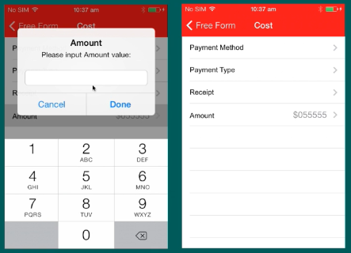
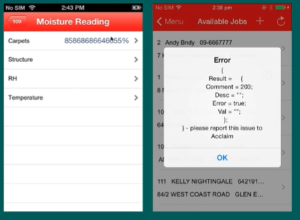
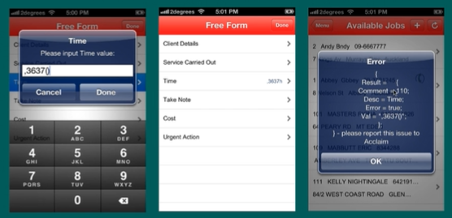
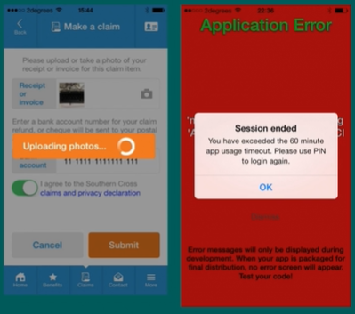
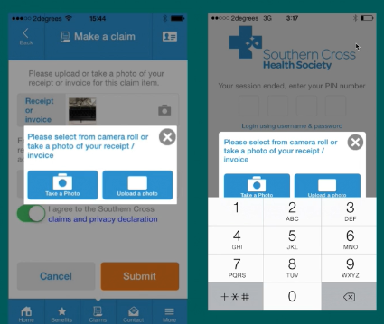

## 讲课

#### Example

Account number

#### Error Guessing

+ Based on the theory that test cases can be developed based upon the intuition and experience of the Test Engineer
+ For example, in an example where one of the inputs is the date, a test enginner might try February 29 2000 or 9/9/99

#### Exploratory Testing (15 min)

Exploratory testing, is all about discovery, investigation and learning. It emphasises on personal freedom and responsibility of the individual tester. Test cases are not created in advance but testers check system on the fly. They may note down ideas about what to test before test execution. The focus of exploratory testing is more on testing as a "thiking" activity.

**Advantages**

It doesn't require preparation for testing as we don't have documents for testing.

In this type of testing time saves due to all task are doing simultaneously like Testing. Designing test scenarios and executing test scenarios.

Tester can report many issues due to incomplete requirement or missing requirement document. 

 **Disadvantages**

Few issues cannot be catch in this type of testing. 

There is review of test planning & designing of test cases/scenario while testing may cause issues. 

Testers have to remember the scenario what he is executing because if any bug is found then tester should report a bug proper steps to reproduce Difficulty to perform the exact manner especially for new found bugs.

+ 80% bugs are not directly related to the Specification
+ Depends on the experience

#### Common Mistakes from Dev (24 min)

+ No data input validation
+ Boundaries not checked (very big values, very small values)
+ Missing error handling (causing the system loose connection). Disk full etc.
+ Interface errors detected only once the system is tested end to end 
+ Problems with invalid characters
+ Problems with strings too long
+ Problems with empty values
+ Problems with data combinations not obvious

#### Example (43 min)

In order to limit the characters that are allowed to enter by user. Developer limit the keyboard to numerical.

Problems:

+ defaults status of button "Done"
+ tap "Done" without entering anything
+ the English letter on the keypad
+ the length of user input 面试时可能问你，看到这个有什么疑问？就可以提这几个。
+ the length of value after decimal point
+ invalid user input, such as :00001

Developer uses the default properties from UI elements.

Validation for the invalid user input.

Correctness validation: length before and after decimal point

Such as: total length is 4 digital, it can be 57.32%, it can also be 999.9%

User friendly error message.

Clip board should be disabled. The length of characters allowed should be limited.

