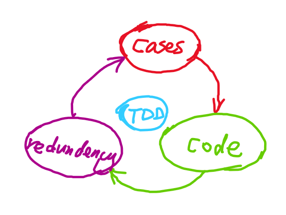

## 讲课

#### Various Types of Testing

**Validation Activities**

Validation is done at two levels

+ Low Level White Box
  + Unit testing
  + Integration Testing
+ High Level Black Box
  + Function Testing
  + System Testing
  + Acceptance Testing

#### Unit Testing

+ Searches for defect and verifies the functionality of software, depending upon the context of the development
+ It occurs with access to code being tested and with the support of development environment
+ Defects are fixed as soon as they are found with out formally recording incident
+ If test cases are prepared and automated before coding, it is termed as test-first approach or test-driven development.

Help to identify the potential bugs as early as possible.

#### Test-Driven Development

Test-driven development (TDD) is a software development process that relies on the repetition of a very short development cycle: requirements are turned into very specific test cases, then the software is improved to pass the new tests, only. This is opposed to software development that allows software to be added that is not proven to meet requirement.

#### Integration Testing

Integration testing, also known as integration and testing (I&T), is a software development process which program units are combined and tested as groups in multiple ways. In this context, a unit is defined as the smallest testable part of an application. Integration testing can expose problems with the interfaces among program components before trouble occurs in real-world program execution.

+ Integration testing tests interface between components, interaction to different parts of system.
+ Greater the scope of Integration, more it becomes to isolate failures to specific component or system, which may leads to increased risk.
+ Integration testing should normally be integral rather than big bang, in order to reduce the risk of late defect discovery
+ Non functional characteristics (e.g. performance) may be included in Integration Testing

#### Functional Testing

+ It is used to detect discrepancies between a program’s functional specification and the actual behaviour of an application.
+ The goal of function testing is to verify whether your product meets the intended functional specifications laid out the development documentation.
+ When a discrepancy is detected, either the program or the specification is incorrect.
+ All the black box methods are applicable to function based testing

#### System Testing (33 min)

System testing is the type of testing to check the behaviour of a complete and fully integrated software product based on the software requirements specification (SRS) document and hardware & Software system. The main focus of this testing is to evaluate Business / Functional / End-user requirements.

- It is concerned with the behaviour of whole system as defined by the scope of development project
- It includes both functional and non-functional requirement of system
- System testing falls within the scope of black box testing.
- On building the entire system, it needs to be tested against the system specification.
- An Independent testing team may carry out System Testing

#### System Testing Types

+ Usability testing
+ Performance Testing
+ Load Testing
+ Stress Testing
+ Security Testing
+ Configuration Testing
+ Compatibility Testing
+ Installation Testing
+ Back up & Recovery Testing
+ Availability Testing
+ Volume Testing

#### Usability Testing

Usability testing is a technique used in user centred interaction design to evaluate a product by testing it on users. This can be seen as an irreplaceable usability practice, since it gives direct input on how real users use the system.

**Principle:** Don't let me think, it should always be initiative and simple. Nobody will spend time to read the user manual before using APP.

**Challenging:** Bias from Project team members

**Hallway Testing**

Hallway testing is a quick, cheap method of usability testing in which randomly-selected people -- e.g., those passing by in the hallway -- are asked to try using the product or service. This can help designers identify "brick walls", problems so serious that users simply cannot advance, in the early stages of a new design.

**A/B testing**

In web development and marketing, A/B testing or split testing is an experimental approach to web design (especially user experience design), which aims to identify changes to web pages that increase or maximise an outcome of interest.

