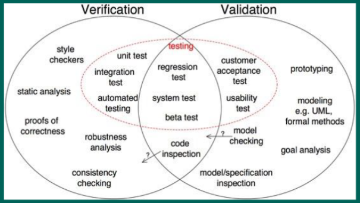
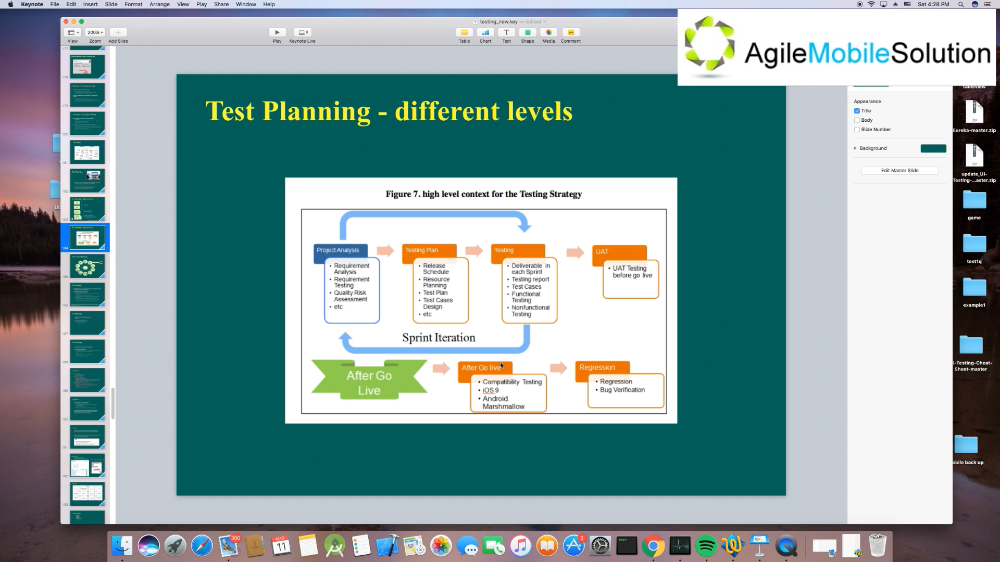
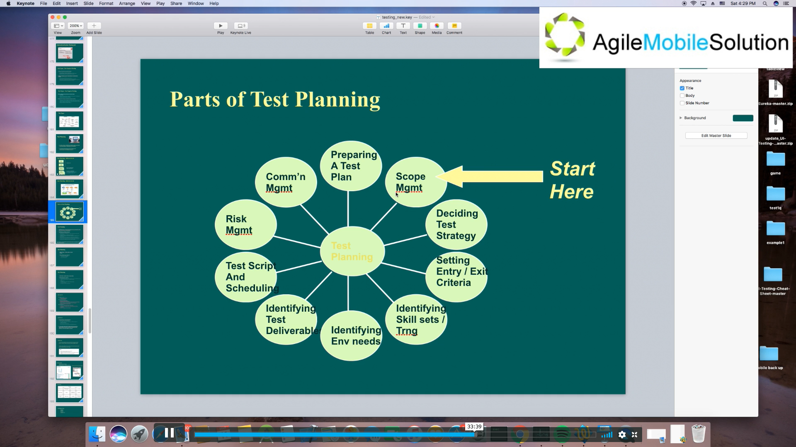
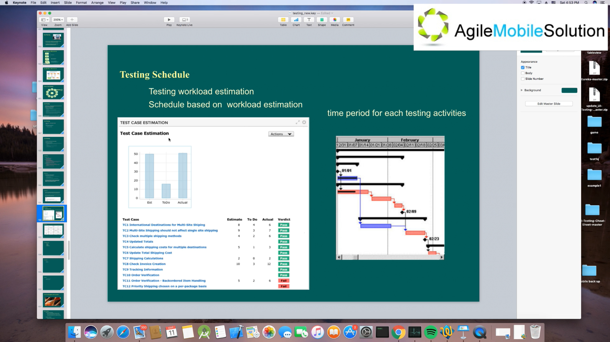

## 讲课

#### Other Testing Types

Other than validation activities like unit, integration, system and acceptance we have the following other types of testing

+ Regression testing
+ Localisation testing
+ Internationalisation testing

#### Regression Testing

Full Regression

Smoke testing (sanity testing) 有个基本的保证

+ Regression testing is not another testing activity
+ It is re-execution of some or all of the tests developed for a specific testing activity for each build of the application
+ Verify that changes or fixes have not introduced new problems
+ It may be performed for each activity (e.g. unit test, function test, system test etc)

Normally happening after all the bugs has been fixed or all the Dev work has been done after finished the functional testing and bug verifications.

> Even the best tester cannot stop the developer who always creates bugs keep creating more bugs. -- How Google Test Software

One of the most powerful ways of improving the quality of the product and the team effectiveness is to focus the testing efforts on **defect prevention** rather than defect detection. This doesn't negate or eliminate the need for testing. Testing for defect detection alone is like simply treating the symptoms of the problem and ignoring the root cause of the real problem. **Defect prevention is about addressing the real problem.**

60% efforts or more in testing activities are about analysing, rather than testing.

功能测试，功能是否正确。

回归测试，改了 bug 或添加了东西也好，会不会造成已经测试过的功能出问题。

#### Localisation Testing (12 min)

Localisation testing is performed to verify the quality of a product's localisation for a particular target culture / locale and is executed only on the localised version of the product.

Localisation Testing - Characteristics:

+ Modules affected by localisation

  such as: UI and content

+ Modules specific to Culture / Locale-specific, language-specific, and region-specific

  such as: date, money symbol

+ Critical Business Scenarios Testing

+ Installation and upgrading tests run in the localised environment

#### Internationalisation Testing (18 min)

The process of designing an application so that it can be adapted to various languages and regions without engineering changes.

主要解决翻译的问题

+ Testing to check if the product works across settings.
+ Verifying the installation using various settings.
+ Verify if the product works across language settings and currency settings.

#### Test Types: The Target of Testing (20 min)

+ Testing of functions (functional testing)
  + It is the testing of "what" the system does
  + Functional testing considers external behaviour of the system
  + Functional testing may be performed at all test levels
+ Testing of software product characteristics (non-functional testing)
  + It is testing of "How" the system works.
  + Non-functional testing describes the test required to measure characteristics of systems and s/w that can be quantified on varying scale
  + Non-functional testing may be performed at all levels
+ Testing of software structure / architecture (structure testing : Unit Testing)
  + Structural testing is used in order to help measure the thoroughness of testing through assessment of coverage of a type of structure
  + Structural testing may be performed at all levels.
+ Testing related to changes (confirmation and regression testing)
  + When a defect is detected and fixed then the software should be retested to confirm that the original defects has been successfully removed. This is called Confirmation testing
  + Regression Testing is the repeated testing of an already tested program, after modification, to discover any defects as a result of changes.
  + Regression Testing may be performed at all levels.

#### Test Planning

> 25 min

+ It is the process of defining a testing project such that it can be properly measured and controlled
+ It includes test designing, test strategy, test requirements and testing resources

Company Level

+ Test Policy 测试政策
+ Test Strategy 测试战略

Project level (IEEE 829) (one for each project)

+ High Level Test Plan

Test stage level (IEEE 829) (one for each stage within a project, e.g. Component, system, etc.)

+ Detailed Test Plan

#### Testing Plan - Different Level

#### Parts of Test Planning

> 33 min

#### Test Planning

+ Test Planning is a continuous activity and is performed in all the life cycle processes and activities
+ Test Planning activities includes:
  + Defining the overall approach
  + Integrating and coordinating the testing activities into software life cycle activities
  + Assigning resources for different tasks defined
  + Defining the amount, level of detail, structure and templates for test documentation
  + Selecting metrics for monitoring and controlling test preparation
  + Making decisions about what to test, what roles will perform the test activities, when and how test activities should be done, how the test results will be evaluated and when to stop the testing
+ Entry Criteria - Defines when to start testing
+ Entry Criteria may consist of 
  + An approved testing plan
  + All resources available
  + All test script developed
+ Exit Criteria - Defines when to stop testing
+ Exit Criteria may consist of
  + Thoroughness measures, such as coverage of code, functionality or risk
  + Estimates of defect density or reliability measures
  + Cost 成本能支持测试多久
  + Residual risk
  + Schedules such as those based on time to market
  + Test Cases Pass rate 通过率
  + The density of high-severity defects 比如测试完有 20 个bug，但都是小问题

> Test Planning is also determined by the resources that are available and can be allocated to the project.

#### Risk Objectives

> Part 2

+ Suppliers Issues
  + Failure of a third party
  + Contractual Issues
+ Organisational Factors
  + Skill and staff shortage
  + Personal and training issues
  + Potential issues, such as problem with testers communication, failure to follow up the the information found in Testing
  + Improper attitude towards testing
+ Technical Issues
  + Problem in defining the right requirement
  + The extent that requirements can be met given existing constraints
  + Quality of design, code and tests

+ Product / Project Risks Objective
  + Error prone software delivered
  + Potential that the software/hardware could cause harm to company/individual
  + Poor software characteristics
  + Software that does not perform its intended functions
+ A risk based approach to testing provides proactive opportunities to reduce the levels of product risks, starting in the initial stages of project

#### Testing Scope

> 4 min

+ For the entire application what are the areas we are going to check. Such as: Functional Testing, Performance Testing, Usability Testing
+ For the entire application what are the areas we are not going to check. Such as: Security Testing, Stress Testing

Scope:

+ Subset of the data will be manipulated to achieve objectives
+ E2E will consist of 28 usage periods over 13 months
+ Categories used in the E2E process will be Media, Music, Video, Special-Category, and other category.
+ These categories will be selected to ensure acceptance coverage of collectives.

#### Testing Schedule

> 6 min

一定要考虑充裕的时间，比如节假日、

**Risk Mitigation Plan**

+ Resource: 风险高是因为，出问题后没有足够的人力来处理

+ Deadline: 延迟时间
+ Roll-back: 是否能回退
+ Affordable risk: 风险是否能承担

**Environment**

+ Software: 数据库软件查询数据信息、更改数据
+ Hardware

**Resource**

+ Human Resources
+ Other Resources

## 面试题

1. 请解释并举例子什么叫回归(Regression)测试？

   Regression Testing is a type of software testing to confirm that a recent program or code change has not adversely affected existing features and verify that changes or fixes not introduced new problems. It is a full or partial selection of already executed test cases which are re-executed to ensure existing functionalities work fine.

   For example, after adding a voice chat feature to an application, the existing text chat function might be tested. 

   > regression / riˈgreʃn /
   >
   > adversely  / æd'vəːsli /
   >
   > partial  / ˈpɑːʃl /
   >
   > execute  / ˈeksikjuːt / **verb**

2. 请解释并举例子什么叫冒烟(Smoke)测试？

   Smoke Testing is a type of software testing that comprises of a non-exhaustive set of tests that aim at ensuring that the basic functions work. The result of this testing is used to decide if a build is stable enough to proceed with further testing.

   For example, verify that the application launches successfully, check that the GUI is responsive, and so on.

3. 回归(Regression)测试与功能(Functional)测试的区别在哪里？

   Before the functional testing we don't know whether the product meets the intended functional specification or not. The goal of a functional testing is to verify it.

   But, a Regression Testing tests those features which was tested before. It might be changed later. Or, some new features was added in the project. So, the Regression Testing will confirm it still works fine and verify that changes or fixes have not introduced new problems.

   > verify  / ˈverifai / 

4. 请解释并举例子什么叫本地化(localization)测试？

   Localisation testing is the software testing process for checking the localised version of a product for that particular culture or locale settings.

   For example, an application released in China should provide a Chinese interface.

5. 请解释并举例子什么叫国际化(Internationalization)测试？

   Internationalization testing is to ensure that application can be adapted to various languages and regions without engineering changes.

   For example, an international website offers multiple language options.

   > adapt  / əˈdæpt / **verb** 

6. 一个测试计划里应该包括哪些内容？

   A test planning includes 3 phases, Project Analysis, Testing Plan, and Testing.

   In the Project Analysis phase, it includes Requirement Analysis, Requirement Testing, Quality Risk Assessment, and so on.

   In the Testing Plan phase, it includes Release Schedule, Resource Planning, Test Plan, Test Cases Design, and so on.

   In the Testing phase, it includes Testing Report, Test Cases, Functional Testing, and Non-Functional Testing.

7. 在做测试计划时要考虑哪些情况？

   The following things need to be considered when planning a test:

   + scope management;
   + deciding test strategy;
   + setting entry / exit criteria,;
   + Identifying skill sets;
   + Identifying environment needs;
   + identifying test deliverable;
   + test script and scheduling;
   + risk management;
   + comments from management;
   + preparing a test plan.

8. 测试的进入条件(Entry Criteria)和测试的退出条件(Exit Criteria)指的是什么？

   Entry criteria defines when to start testing. It may consist of an approved testing plan, all resources available, and all tests developed.

   Exit criteria defines when to stop testing. It may consist of thoroughness measures, estimates of defect density or reliability measures, cost, residual risk, schedules, test cases pass rate, and the density of high-severity defects.

9. 测试的范围(Scope)是指什么？

   It is what are the areas we are going to check and not check for an application.