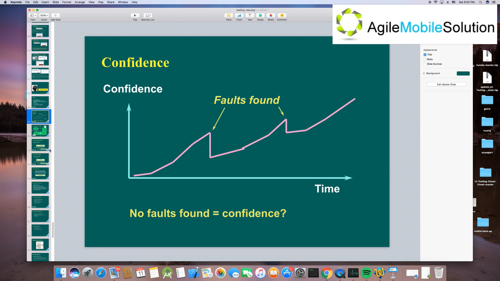
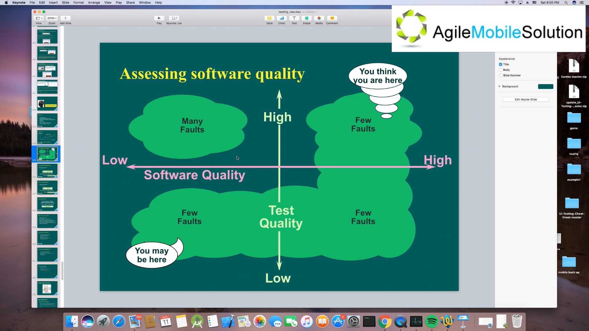
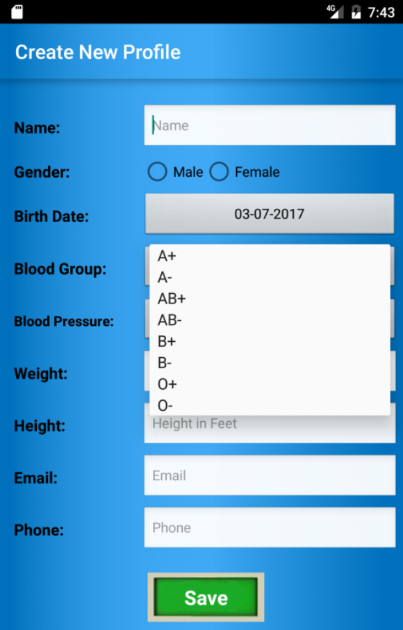
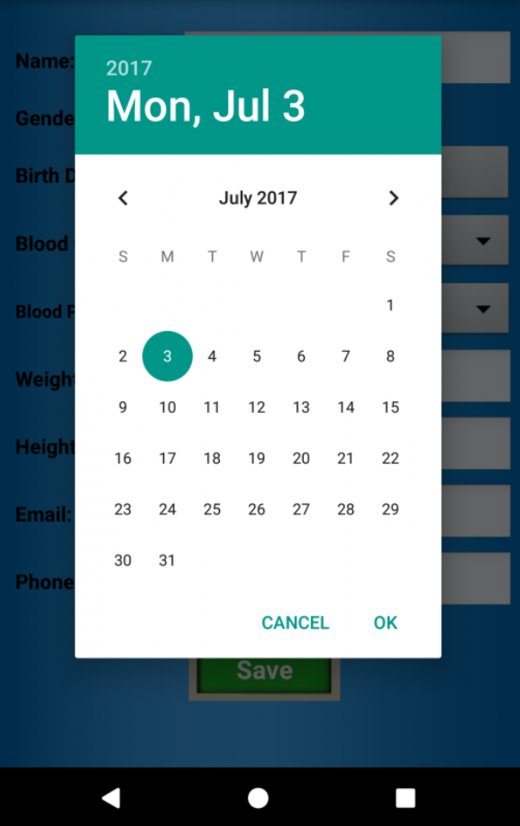

## 讲课 Test Case Designing and Execution

#### Test Case Design

Purpose of Test Case Design

+ Guidance in functional testing (70% in Black box Testing)
+ Ensure all the functionalities has been covered by the tests
+ The pass ratio of test cases is the rough reflection of the quality. 在某种程度上是软件质量的反映。

Test Design Techniques

+ Boundary Value Analysis (BVA)
+ Equivalence Partitioning (EP)

#### Characteristics of good test case

+ Accurate 非常精确

  Tests what the description says it will test 需求文档说什么，那么就测试什么

+ Economical

  Separate the initiation steps

  Has only the steps needed for its purpose

  数据的准备是不放在测试用例里的

+ Repeatable, self-standing

  Same results no matter who tests it

  Don't rely on tester experience when using scripted test

+ Traceable

  Forward to logs

  Backward to a requirement

+ Self-cleaning

  Returns the test environment to a start state

+ Appropriate

  No Pesticide Paradox presents

**Pesticide Paradox**

Reason:

1. The Practical Impossibility of Testing all Possible Scenarios; 测试用例没有覆盖到所有场景
2. The functionality of the application changes over time. 需求在更改，原来的测试用例已过时
3. We (humans) tend to be especially careful only on places where we feel imminent danger.

Solutions:

1. Keep track of product changes and their indirect effects in your application.
2. Discontinue tests that are not effective
3. Modify your test data. 不要每次都用同样的参数、类型
4. Last but not least, don't put all your trust and weight on format approaches only.

#### What consist of a good test case

> 18 min

+ Identification 唯一确定
+ Description
+ Input & Output
+ Environmental Needs
+ Dependencies

#### Test Case Example

> 20 min

Check response on entering **valid** Name and Password

Check response on entering **invalid** Name and Password

Check response when **ID is empty** & Login button is pressed

| Test Scenario | Test Case           | Test Data              | Expected Result |
| ------------- | ------------------- | ---------------------- | --------------- |
| Check Login   | Check response on   | UN: 1457217 PS: abcdef | Login must      |
|               | entering valid Name | UN: 2147859 PS: abcdef | be              |
| Functionality | and Password        | UN: 3541527 PS: abcdef | successful      |

Test Steps missed

1. Launch Application
2. Enter ID and Enter Password
3. Click the Login button

Pre Conditions messed

> Pre-Conditions which specifies things that must in place before the test can run

QQ Application must be installed

#### Decision Table Testing

> 28 min

Decision Table Testing is a good way to deal with a combination of inputs, which produce different results. It helps reduce test effort in verifying each and every combinations of test data, at the same time ensuring complete coverage.

对有效性进行划分，减小工作量的同时，保证测试质量。

优势：结果一样的覆盖，数量变的很多时，排列组合将非常多，应用这个技术，从结果做分组，有效地把测试范围降低，同时保证测试质量。

#### State Transition Diagrams

State Transition testing is defined as the testing technique in which changes in input conditions causes state changes in the Application Under Test(AUT). State Transition diagrams can tell us the crucial state transitions and invalid ones that both should be tested.

它得出来的结果是一样的结果，或者规则是一样的，降低工作量同时保证质量。

优势：保证每个状态都能测试到？

#### Why Test?

+ build confidence - YES
+ prove that the software is correct - NO
+ demonstrate conformance to requirements - YES
+ find faults - YES
+ reduce costs - YES
+ show system meets user needs - YES
+ assess the software quality - YES

#### Confidence

> 49 min

#### A traditional testing approach

> 53 min

Show that the system:

+ does what it should
+ doesn't do what it shouldn't

#### A better testing approach

Show that the system:

+ does what it shouldn't 它是否做了它不应该做的事情
+ doesn't do what it should 它是否没做它应该做的事情

Goal: find faults

Success: system fail

#### The testing paradox

Purpose of testing: to find faults. Finding faults destroys confidence. Purpose of testing: destroy confidence. Purpose of testing: build confidence.

> The best way to build confidence is to try to destroey it.

#### Who wants to be a tester?

> 60 min

+ A destructive process
+ Bring bad news ("Your baby is ugly")
+ Under worst time pressure (at the end)
+ Need to take a different view, a different mindset ("What if it isn't?", "What could go wrong?")
+ How should fault information be communicated (to authors and managers?)

#### Testers have the right to:

取决于公司的策略

+ accurate information about progress and changes

#### Testers have responsibility to:

> 70 min

+ follow the test plans, scripts etc. as documented
+ report faults objectively and factually (no abuse!)
+ remember it is the software, not the programmer, that you are testing
+ assess risk objectively
+ prioritise what you report
+ communicate the truth

#### Test your own work?

+ find 30% - 50% of your own faults
+ same assumptions and thought processes
+ see what you meant or want to see, not what is there
+ emotional attachment

**don't want to find faults**

**actively want NOT to find faults**

## 面试题

1. 设计测试用例(test case design) 的方法有哪些方法？

   There are four major methods, Boundary Value Analysis, Equivalence Partitioning, Decision Table, and State Transition.

2. 一个好的测试用例有哪些特征？

   A good test case have these characteristics:

   + Accurate, it should clearly describe what will be tested.

   + Economical, it should separate the initiation steps from the steps needed for its purpose.
   + Repeatable, it should give the same results no matter who tests it.
   + Traceable, there should be logs. The requirements document entries associated with a test case can be traced by the logs.
   + Self-cleaning, it will return the test environment to a start state. So it won't effect other test cases.

3. 什么叫做测试用例的杀虫剂效应（Pesticide Paradox），如何去规避这样的情况发生？

   Pesticide Paradox means that as the tests are run multiple times, they stop been effective in catching bugs. In addition, part of the new defects introduced into the system will not be caught by the existing tests and will be released onto the field.

   There are four major solutions:

   Firstly, we should keep track of product changes and their indirect effects in the application.

   Then, we should discontinue tests that are not effective.

   Next one is modifying the test data each time.

   The last one is we should not put all trust and weight on formal approaches only. We could think something not in the requirement document.

4. 请用等价类划分和边界值分析的方法为下面这个APP表单界面写测试用例。

   A table here.

   Let's assume the Height should be a positive natural number less than or equal 10,  accurate to two decimal places.

   Valid equivalence classes: any positive natural number less than or equal 10, accurate two decimal places.

   Invalid equivalence classes: Empty, Space, Special Characters, number less than or equal 0 or greater than 10, Emoji.

   It could take these boundary values: Low boundary plus and minus 0.01: -0.01, 0.01; On the boundary: 0, 10; Upper boundary plus and minus 0.01: 9.99, 10.01

5. 用决策表(Decision Table )测试的优势在哪里？

   It can effectively reduce the test range based on the classification of the results, at the same time ensuring complete coverage.

6. 用状态图(State Transition Diagrams )测试的优势在哪里？

   ~~It will provide a pictorial or tabular representation of system behaviour which will make the tester to cover and understand the system behaviour efficiently. Only the critical states will be tested. So, it can reduce the test range and make sure a better coverage.~~
   
   In a state table, all the valid states are listed on the left side of the table, and the events that cause them on the top. So, it is easy for us to find out the crucial state transitions and invalid ones that both should be tested. It also can tell us which states are invalid.

