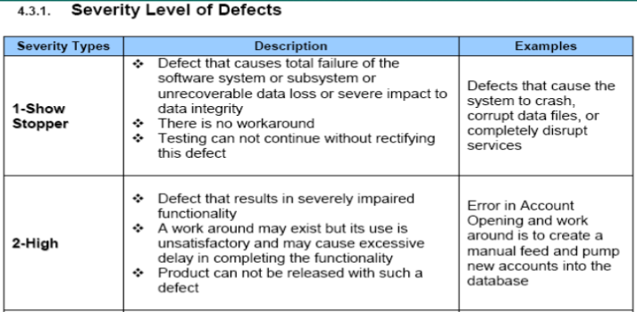
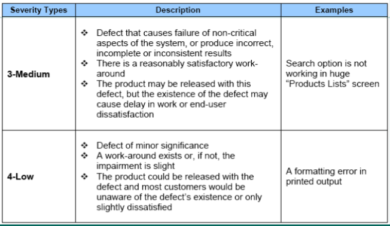

## 讲课

#### Defect Management

**What is definition of defect?**

A flaw in a system or system component that cause

**Defect Discovery**

Find Defect > Review & Report Defect > Acknowledge Defect

**Defect Resolution**

Prioritize Risk > Schedule Fix > Fix Defect > Report Resolution

Schedule Fix 指的是在哪个版本修改，而不是什么时候

#### Defect Life Cycle

When a tester reports a Defect, it is tracked through the following stages: New, Open, Fixed, and Closed. A defect may also be Rejected, or Reopened after it is fixed. A defect may be Deferred for a look at a later point of time.

By default a defect is assigned the status New.

A quality assurance or project manage reviews the defect, and determines whether or not to consider the defect for repair. If the defect is refused, it assigned the status Rejected.

If the defect is accepted, the quality assurance or project manager determines a repair priority, changes its status to Open, and assigns it to a member of the development team.

A developer repairs the defect and assigns it the status Fixed.

Tester retests the application, making sure that the defect does not recur. If the defect recurs, the quality assurance or project manager assigns it the status Reopened.

If the defect is actually repaired, it is assigned the status Closed.

#### Defect Life Cycle Paths

New - Open - Assigned - Fixed - Closed

New - Reject

New - Deferred

New - Open -Assigned - Deferred // 到了开发那，他觉得没必要改，再同 BA 商议，最后决定先不改

New - Open -Assigned - Cannot Reproduce - Reject

New - Open -Assigned - Cannot Reproduce - 

New - Open -Assigned - 

#### Defect Classification

> 15 min

#### How many testers do we need to change a light bulb?

+ None. Testers just noticed that the room was dark.
+ Testers don't fix the problems, they just

#### What Do You Do When You Find a Defect?

> 21 min

+ Communicate with Developer, or BA, or PM depends on your confidence on bug and severity of bug.
  + 当发现一个非常严重的 bug 而且现在时间非常晚了
  + 当发现一个 bug 不是那么严重，并且自己不确定它是不是一个 bug
+ Report a defect
+ The point of writing Problem Reports is to get bugs fixed.

#### Some typical defect report fields

> 27 min

+ Summary
+ Priority
+ Component
+ Assignee
+ Affects Version
+ Severity
+ Reproducible
+ Description

#### Description in Report Fields

> 32 min

+ Build Version
+ Environment
  + Software
  + Hardware
+ Pre-Condition
+ Steps 要不要精简
+ Expected Result
+ Actual Result
+ Reproducibility
+ Analysis 加一些评论，这个 bug 带来了一些什么影响，你觉得它是否应该被修复，为什么可以暂时不修复，它给客户带来了哪些困扰。
+ Attachment
  + UI Screenshot
  + Crash Log

**The purpose of bug report:** Tracking bug to make sure it is handled. (not always get fixed)

**The characteristics Good bug report**

Objective: honestly note down the summary of the bug. no exaggerated description or downplay the importance of the bug

Wording: no emotional words.(incorrect vs. messy, invalid vs. stupid)

Simple: use the simple and understandable language,  just consider the readers are ignorant who knows nothing about the Application under test since bug readers can be anyone, PM, PO,BA, UI Designer. 

Precondition: note down the precondition if it does matter. 

Steps: the bug should be replicable by everybody by flowingly the steps, and steps should logically make sense. 

Testing Data: if the bug can only be reproduced by using a particular data, the testing data should be enclosed as well, such as user account. 

Screenshot: image can express more info than plain text. 

Comments: express your understanding for this bug, and possible impact to the user, and why you thing this bug should or should not be fixed. 

(lots of bugs detected by tester but decided not to fix because of the comments not reflecting the importance of fixing it some cosmetics bugs get fixed at the last stage and introducing the high-severity bugs)

#### Who reads the defect reports?

+ Project Manager
+ Executives
+ Development
+ Customer Support
+ Marketing
+ Quality Assureance
+ Any member of the Project Team

#### Why Automation

> 43 min

**Advantages:**

+ Frees up the time of the testers

  Regression testing is time-consuming, testers can have more time focus on error-prone scenarios by doing exploratory testing.

+ Confirmation of the know

  Increase the confidence for the known scenarios

  第二天早上，可以拿到测试报告

+ Efficiency

  For the full regression testing, Automation test can be running at night, and project team can get the testing feedback next day morning.

+ Quick Feedback

  Automated smoke testing to access the basic quality before conducing intensive testing.

**Disadvantages:**

+ Time saving and time consuming

  Automation testing is more a work of developing, not testing.

+ False sense of quality

  All automated checks in a test suite can happily pass, but there could be major flaws undetected, because the automated check was not supposed to “look” for those failures.

   such as: UI issue.

  它测试的都是正常流程，而这些流程是不容易出错的。

+ Not Reliable

  Automated checks can fail due to many factors, such as: code changes, UI changes, environment.

+ Maintenance Time and Effort

  if you have automated checks in place, you will need to spend the time upgrading the relevant tests as the application is upgraded. If the regression packs are not kept up to date, you start seeing failing tests that fail due to upgrades rather than identifying real bugs, as well as tests that are no longer applicable.

+ Not many bugs found

  Automated regression checks on the other hand always follow  a given path and sometimes with the same set of test data. This reduces the chance of finding new defects in the application.

#### Manual Testing vs. Automation testing

| Manual Testing                                               | Automated Testing                                            |
| ------------------------------------------------------------ | ------------------------------------------------------------ |
| Manual testing is not accurate at all times due to human error, hence it is less reliable. | Automated testing is more reliable, as it is performed by tools and / or scripts. |
| Manual testing is time-consuming, taking up human resources. | Automated testing is executed by software tools, so it is significantly faster than a manual approach. |
| Investment is required for human resources.                  | Investment is required for testing tools.                    |
| Manual testing is only practical when the test cases are run once or twice, and frequent repetition is not required. | Automated testing is a practical option when the test cases are run repeatedly over a long time period. |
| Manual testing allows for human observation, which may be more useful if the goal is user-friendliness or improved customer experience | Automated testing does not entail human observation and cannot guarantee user-friendliness or positive customer experience. |
|                                                              |                                                              |

Manual testing is best suited to the following areas/scenarios:

**Exploratory Testing** This type of testing requires the tester’s knowledge, experience, analytical/logical skills, creativity, and intuition. The test is characterised here by poorly written specification documentation, and/or a short time for execution. We need the human skills to execute the testing process in this scenario. 

**Usability Testing** This is an area in which you need to measure how user-friendly, efficient, or convenient the software or product is for the end users. Here, human observation is the most important factor, so a manual approach is preferable. 

**Ad-hoc Testing** In this scenario, there is no specific approach. It is a totally unplanned method of testing where the understanding and insight of the tester is the only important factor.

Automated testing is the preferred option in the following areas/scenarios:

**Regression Testing** Here, automated testing is suitable because of frequent code changes and the ability to run the regressions in a timely manner. 

**Load Testing** Automated testing is also the best way to complete the testing efficiently when it comes 

to load testing. Learn more about load testing with our best practices guide here

**Repeated Execution** Testing which requires the repeated execution of a task is best automated. 

**Performance Testing** Similarly, testing which requires the simulation of thousands of concurrent users requires automation.

## 面试题

1. 请解释一个bug/defect的生命周期

   It starts when a defect is found.

   Then it will be reviewed by the lead of the tester or the BA. It may be rejected as it is not a real bug, or deferred as it is not important at that time, or assigned to a developer to fix it.

   When the developer starts analysing and working on the defect, the state of the defect becomes Open.

   After that it may be rejected as it cannot be reproduced, or deferred as fixing it may cause more problems, or fixed by the developer.

   Then it goes to the retest state. If it cannot pass the test, it will back to Open state.

   After it pass the test, it will go to Verified state. A regression testing may be performed to verify that it has not introduced new problems.

   Finally, it will be closed.

   > defer  / diˈfəː(r) / [VN]
   >
   > verified  / ˈverifai /
   >
   > regression  / riˈgreʃn /

2. 写一个bug/defect report，需要在defect/bug 描述里加上哪些内容

   These contents should be written in the description part.

   + Build Version, so the developer knows the defect comes from which version;
   + Environment, like Software, Hardware and network;
   + Pre-Condition, like test account;
   + Steps, so others know how to reproduce the defect;
   + Expected Result and Actual Result;
   + Reproducibility, whether it can be reproduced every time;
   + Analysis, like what are the effects;
   + Attachment, like UI screenshot, Crash log.

   > description  /diˈskripʃn/

3. 请按bug/defect report的标准，写一个在之前的课上我们测试过的APP上你发现的bug

   见表格

4. 自动化测试的优势有哪些

   There are four major advantages.

   First one is it frees up the tester's time.

   Then it could increase the confidence. When all automated checks in a test suite pass, the tester knows the application works well basically.

   Next one is it is efficient. For the full regression testing, automation test can be running at night, and the project team can get the testing feedback next day morning.

   The last one is testers could get a feedback quickly. By an automated smoke testing, the tester could quickly know the application is prepared for more testing.

   > efficient  / iˈfiʃnt / **adj.**
   >
   > confidence  /ˈkɔnfidəns /

5. 自动化测试的劣势有哪些

   There are five major disadvantages.

   Firstly, the test scripts need to be developed. Sometimes, it is time consuming.

   Then, it will create false sense of quality. There could be major flaws undetected, because it cannot look for those failures, such as UI issue.

   It may be not reliable, because for the code changes, UI changes, and different environments.

   Testers will need to spend the time upgrading the relevant tests as the application is upgraded.

   The last one is that it cannot find many bugs. For example, the automated regression test always follow a given path and even the same set of test data. It reduces the chance of finding new defects in the application.
   
   > consume  / kənˈsjuːm / **VN**
   >
   > sense  / sens /
   >
   > reliable  / riˈlaiəbl / **adj.** 
   >
   > relevant  / ˈreləvənt / 