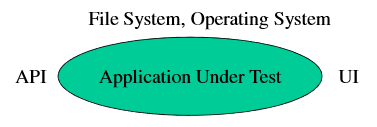
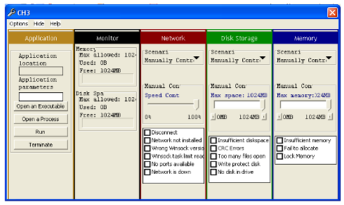

by James Whittaker

## Practical Guide to Testing

+ Consider the system as a whole and their interactions

Human invokes app -> App requests memory from OS ->

App interfaces with database, API, libraries ->

App opens, reads, and closes files.

## Testing

+ Let's examine attacks from these perspectives
+ User Interface
  + Black Box: Inputs and Outputs
  + Open Box: Explore stored data, computation and feature interaction
+ System Interface
  + File System
  + Operating System

## Black Box User Interface

#### Attack #1

Apply inputs that force error messages to occur

+ Basic test to ensure that software responds appropriately to bad input
+ Ensures developers wrote code to handle erroneous input, something that is often not in their mindset
+ How to carry out: explore input types, length, boundary values
+ Example: Word 2000, Insert, "Index and Tables", change "Columns" to five, press enter. Get two error messages.

Example:

On Windows ME, PowerPoint 2000, inserting MSVSA Button Class Object from "Insert" menu, "Object" item

PowerPoint found and error that it can't correct. You should save presentations, quit, and then restart PowerPoint.

#### Attack #2

Apply inputs that force the software to (re) establish default values

+ If software tries to use a variable before it is initialized to a proper value, the software will fail
+ How to carry out: Change default values, enter null values, enter legit values and switch to null values
+ Example: Word 200, Insert, "Index and Tables", "Table of Content", click "Options" and Enter. Anything missing?

#### Attack #3

Explore allowable character sets and data types

+ Example, in an input string, try NULL character or other characters that might be used as delimiters
+ Unix uses ^D as text end-of-file, program might terminate or behave unpredictably
+ n some bugs, shell command strings can be sent

#### Attack #4

Overflow input buffers

+ Exceeding array or structure size will cause a crash
+ How: input long strings or other data beyond “normal” size
+ Example : Word 2000, find/replace.  Replace a short string with one that is 255 characters long.  Windows Word crash.

Such bugs are more serious in a server or other component that could be exploited to run arbitrary code.

#### Attack #5

Find inputs that interact and test combinations of their values

+ Check to see if integration testing has been adequately performed
+ How to carry out: identify candidate processes that are normally separate, but through some interaction may share a common data structure
+ Example:  Word 2000, insert table.  Max columns = 63 but Max rows = 32767. App hangs if enter 32000+ rows and 50+ for columns.

#### Attack #6

Repeat the same input or series of inputs numerous times

+ Applicable when input received within a loop. May consume resources or cause data initialization problems.
+ Example : memory leak, chunk of allocated memory not released

#### Attack #7

Force different outputs to be generated for each input

+ This checks if all major behaviours associated with each input are tested
+ How: A single input often causes different outputs depending on the context
+ Example: picking up the phone when someone else is on the line, vs. idle

#### Attack #8

Force invalid outputs to be generated

+ Similar to attack #7, but focusing on invalid outputs
+ One key ingredient 因素 is often input sequencing to generated the invalid output
+ Example:  Feb 29, 2001 possible on Windows NT date/time clock if Feb 29 selected on a valid date (leap year) then change year to 2001

#### Attack #9

Force properties of an output to change

+ Gives testers a way to think about persistent outputs; outputs that hang around on the screen or file can be updated in ways to break the software
+ How to conduct: Set properties to one value, then try changing to something else
+ Example: WordArt in Windows 2000.  Enter long word art – too big to fit on the screen.  This sets the width/height properties.  Then edit to a single letter.  The width/height properties stay the same.

#### Attack #10

Force the screen to refresh

+ There are often errors with refresh events where not everything is repainted correctly
+ How to conduct: resize, minimize, drag objects about so they are overlapping
+ Example:  Equation Editor in Word 2000 has refresh problems as formulas are added

#### Open Box Attack #11

Apply inputs using a variety of initial conditions

+ Search for a configuration where internal data s incompatible with the inputs and input sequences
+ As with all open box attacks, requires access to the source to design the attack

#### Attack #12

Force a data structure to store too many or too few values

+ The overflow/boundary check problem for arrays or data structures
+ Even dynamic structures like lists or stacks have upper bounds
+ How to conduct : Read/write beyond size of allocated array or data structures
+ Example : Table in Word with 32767 rows and 50 columns

#### Attack #13

Investigate ways to modify internal data constraints

+ More general form of previous attack; rather than concentrate on overflowing size, investigate violating any constraint (e.g. dimension, location on screen, etc.)
+ How to conduct:  Look for constraints and see if there are any ways to access ways to violate 违背 them
+ Example: PowerPoint 2000.  Insert table; allows only 25x25 in creation.  But then edit the table to insert a row and column (boom!)

#### Attack #14

Experiment with invalid operand and operator combinations

+ Verifies that computations do not take place with incorrect or invalid data, that the software accounts for more global exception handling
+ Ex: divide by zero
+ Example: Windows calculator.  Take square root of 4 (inverse x^2). Then square and subtract 4.  Don’t get zero!  (close, though).  Windows hides the floating point format in rounding the number.

#### Attack #15

Force a function to call itself recursively

+ Checks if developer correctly handles the termination case and whether or not an object can interact with itself
  + Can manifest itself as an infinite loop
+ How to conduct: Find recursive calls and test if there are ways to invoke them
+ Example: Insert a footnote within a footnote in Word 2000;  get weird behaviour, should be disabled

#### Attack #16

Find features that share data or interact poorly

+ These are candidates for errors with integration, especially when we are mixing data types or creating new data structures
+ How to conduct: Look at shared features and ask if the same inputs can be applied to each feature in question
+ Example: Word 2000, resize embedded text box, picture, word art, or drawing objects that have been grouped together

## System Interface Attacks

+ First let’s look at attacks through the file system
+ Inputs from the file system similar to inputs from the user
  + But often even worse since many apps expect user input to be weird, but files often expected to be consistent with some specified format
  + Media Based Attacks: Simulate problems with the storage media, e.g. failure in the disk
  + File Based Attacks:  Problems with properties of a particular file

#### Attack #1

Fill the file system to its capacity

+ Has the developer tested for this potential problem?
+ A crash would be undesirable when the user has the chance to free up some space to allow execution to continue
+ How to conduct: Fill file system, try file operations

#### Attack #2

Force the media to be busy or unavailable

+ A resource may be unavailable in a multi-tasking operating system
+ Does the app wait, lock, or ?
+ Typically we can look at issues such as delayed response times; may need to put up appropriate delay error messages

#### Attack #3

Damage the media

+ Useful for software that should work despite damaged media, or software that should at least detect that there was a problem with the file
+ Dust, dirt, scratches, magnetic scrambling

#### Attack #4

Assign an invalid file name

+ File names often restricted by the file system, or can exploit common standards used by the file system (long names, weird characters, etc.)
+ Example: Saving a Word file as startrek;starwars-8.1.2001  is saved, but the "".doc” extension is not generated and a user could not double-click to open it

#### Attack #5

Vary file access permissions

+ Can uncover subtle bugs if apps might require most general permissions
+ Example: Web server app may not function properly unless “all” permission set to readable, but then this might compromise security

#### Attack #6

Vary or corrupt file contents

+  Simulates data being modified intentionally (perhaps maliciously) or incidentally (e.g., during transmission).  Many apps may not check for an error code.
+ Ex:  With Excel, a carefully placed bad block causes the file to open, but then Excel crashes with a memory pointer error (Instruction referenced memory at address 08).  Should notify user the file is bad.

## Operating System Attacks

Next, let’s look at various attacks through the operating system (excluding the file system)

#### Attack #1

Exhaust the amount of physical memory

+ Does the application handle cases when no more free memory is available on the heap?
  + C/C++ coders:  When was the last time you checked if your “new” call returned null?
+ Can also test under varying amounts of memory or generating other memory faults

#### Attack #2

Inject Network Faults

+ Explore network traffic, load on a particular port, or loss of services (e.g. network is down, port unavailable)
+ Useful to examine performance
+ E.g., on versions of IE can lose current page if network shut down

## Generating System Faults

Some of these system faults are difficult to generate, e.g.

+ Out of memory
+ Locked memory
+ Out of disk space
+ CRC errors

Tools exist to simulate the system software

+ Tester can inject faults of choosing
+ Ex. Canned HEAT or Holodeck from Florida Institute of Technology
+ Virtual machine, e.g. VM Ware of Virtual Server

#### Canned Heat 3

## Conclusions

+ Being a tester is like studying for a Ph.D.; the more you learn, the more you realize there is much more to know
+ Testing is not something one can master, always something new to learn
  +  But we can learn what kind of tests to perform and what kind of bugs are common
+ Testing often not as glamorous as developing, but requires lots of creativity and often as much expertise as the developer to do well
  + Can be challenging and also fun to find bugs!

