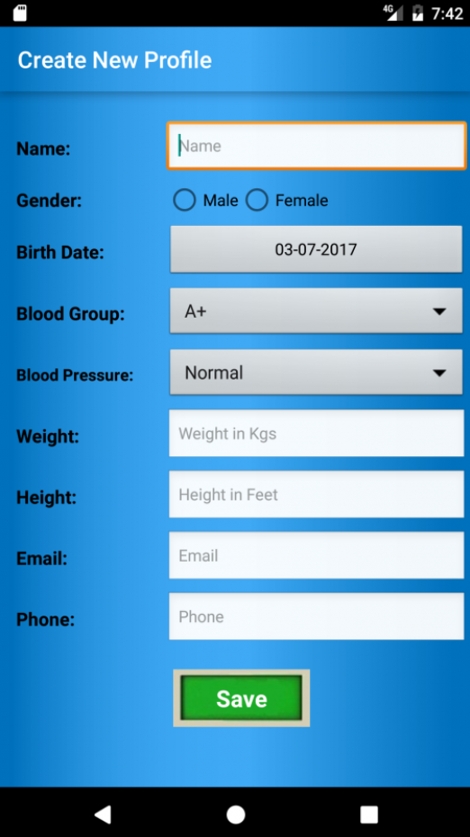
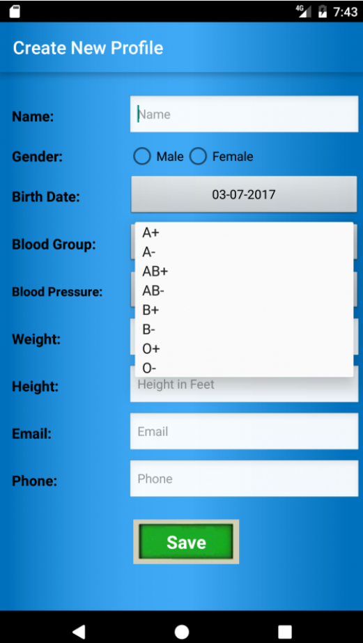
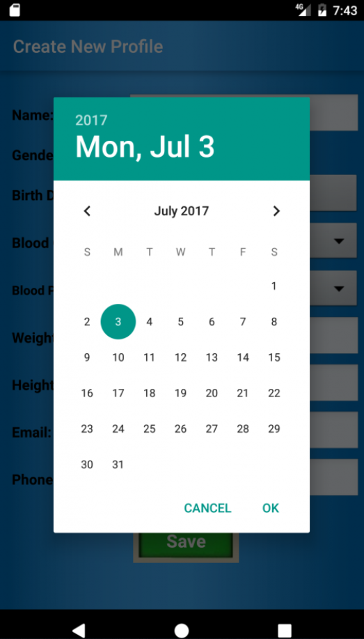

#### 		Day 01

1. 为什么需要软件测试。

Software testing could check whether the developed software meet the requirements or not. It also could identify defects. When the defects are fixed, the quality of the product could improve.

2. 请你说说对BUG的定义和理解

A bug is that a software do some unexpected things or cannot meet expected requirements

A bug could be an error, a fault or a failure. When an error is made by someone, it creates a fault in the software and then could cause a failure in operation.

3. Bug产生的原因。

The reasons could come from developers and external factors.

Firstly, no one is perfect. So anyone might make mistakes.

On the other hand, working under great pressure or without enough time may cause more bugs produced. For example, a video game called E.T. published by Atari had only 5 and half weeks for developing. That might be why it became one of the worst video games.

4. 软件一定是需要测试的吗？

   

5. 是所有的 Bug 都需要 fix 吗？

   Not all bugs should be fixed. It depends on how much the fixing cost and the cost will be caused by the bugs. Both directly and indirectly cost should considered, like clients' feeling when they find a bug.

#### Day 02

1. 当软件出现 bug，出现质量问题，这是开发人员的问题吗？

   有可能是开发人员的问题，但大部分问题来自产品规格文档。（商业文档、需求说明）

   Probably, but most bugs come from where is not clear in the specification.

2. 是什么原因造成了软件 bug 的产生？其中最大的原因是什么？

   可能造成软件 bug 产生的原因有：

   - 产品规格书对业务描述不清楚；
   - 设计时不考虑将来，只考虑这样做能不能 work，缺乏扩展性；
   - 代码造成软件问题
   - 第三方引用

   其中最大的原因是软件规格书中描述不清。

   There are 3 major things might cause bugs:

   a. There are unclear descriptions in software specifications. It means that the team do not clear what clients wanted. (The requirement documents doesn't describe clearly. So the team cannot get what clients wanted.)

   b. Some mistakes in design phase.

   c. There are mistakes in codes.

   There are some other things could cause bugs. For example, a project use a third party library, and there are bugs in that library.

   I think the most important one is unclear descriptions in requirement documents.

3. 软件测试是测试什么？

   Software testing is testing the correctness, completeness and quality of developed software. It is also testing performance, safety, fault-tolerance or security.

4. 我们说一个系统是稳定的是否代表这个系统是没有 bug 存在？

   A reliable software does not mean there is no bug.

   Software reliability is the probability that software will work properly in a specified condition and for a given amount of time.

   It related to the mean time between failures (MTBF).

   MTBF consists of mean time to failure (MTTF) and mean time to repair (MTTR).

   MTTF is the difference of time between two consecutive failures and MTTR is the time required to fix the failure.

   So, the shorter MTBF the better reliability of the software.

   It also means any software has bugs, and there will be failure sometime.

   > reliable  / riˈlaiəbl / **adj**
   >
   > consist  / kənˈsist /
   >
   > consecutive  / kənˈsekjətiv / **adj.**

5. 为什么说 bug 要越早发现越好？

   The earlier the bug is discovered, the less it needs to be done for fixing it. For example, if a bug is discovered before the software designed, only some descriptions in the software specification should be modified. But if it discovered after codes have done, the designs and codes should be fixed too.

   If a unclear description is found before design phase, only specification should be modified. But if it is found after development phase, the design work and code should be fixed, too.

#### Day 03

1. 你认为成为一个好的测试工程师需要哪些素质，为什么？

   A good tester should be an explorer, a trouble shooter, tactful and diplomatic.

   Firstly, tester not only test a software according the specification, but also beyond it. Bugs often come from where is unclear in the specification. So a good tester should be an explorer to search these unclear places.

   Then a good tester should be a trouble shooter. When a bug appears, he should aware it is a bug immediately, and record it as soon as possible. Without this a tester might miss many bugs everyday.

   The last one is tactful and diplomatic. For example, when a tester talk with a developer that a bug was found in his codes. The tester may meet with resistance from the developer. But if the tester say he is not sure whether he got the right way, but something strange happened, the developer might aware there is a bug.

   > explorer  / ikˈsplɔːrə(r) /
   >
   > tactful  / ˈtæktfl / **adj.** 
   >
   > diplomatic  / ˌdipləˈmætik /   resistance  / riˈzistəns / 

2. 我们说保证软件的良好质量，就要去测试软件所有的一切，做穷举（exhaustive）测试，这句话对吗？为什么？

   No. The time and budget for any project is limited. So testing everything is impossible. When the testing is enough, we believe the quality of the software is good. How much testing is enough depends on the risks for the system.

3. 在一个项目里面，项目的budget是有限的，项目的交付时间是有限的，项目的人力资源也是有限的，在这些有限的条件下，怎样的测试才算足够？依据是什么？

   When you have proved that the system works correctly, the testing is enough.

   And it depends on the risks for the system. The risks could be not only missing important defect and causing failure costs, but also market share. After risk analysis, testing plan should be made according to the level of risk and the budget. High level of risk things are priorities.

   > priorities  / praiˈɔrətaiz /

4. 通过风险凭估可以决定测试活动中的哪些工作安排？

   老师给的答案：Depend on the risk for the software, it can determine which part need to be **tested first**, which need to be **tested most,** which part need to be **thoroughly** tested and which part **doesn’t need to be tested.** 

   > thoroughly  / ˈθʌrəli/
   >
   > determine  /diˈtəːmin/

#### Day 04

1. 按照优先级来安排测试工作的依据是什么？

   The basis for prioritising testing is RISK. We should ensure having enough time to handle important testing.

   > prioritize / praiˈɔrətaiz/

2. 请解释风险矩阵的用途，以及风险矩阵中 12 个风险项的意思？分别给出自己的例子。

   从不同维度进行分析，我们把它放到这个矩阵里面。最后加在一起作为这个项目的风险级别。

   > matrix  / ˈmeitriks /
   >
   > consequences  / ˈkɔnsikwəns /

   Using risk matrix can clarify the attendant risks and possible consequences of carrying out or bypassing specific test activities. Each item in the matrix could be analysed, then the risk of project could be concluded by the summary of them. There are 12 risk items in the matrix.

   - The first one is Knowledge of area. It means the more familiar the tester is to the area, the fewer defects will be missed. For example, a tester is going to test a video record software. If he doesn't familiar with it, he might record a video then check whether it is successful. If he know more about how it works, he might check the synchronisation of video and voice and effect of object's speed. 知识储备是什么，比如说项目要实现的商业目标；
   - Next one is Reputation. It means when a problem occurs how much it will affect company's reputation. If a report of a bug spread on the Internet, it will seriously affect the company's reputation. 名望，外部对公司形象的损失，对个人的信誉度。比如一个 bug 被用户发现后在互联网传播，对公司品牌形象的损失就很大。
   - Next one is Impact on Users. It means how serious is a bug affect users. If the software is for medical use, it may take away the patient's life. However, if the software is for entertainment, it is not so serious.用户多的时候风险大。
   - Next one is Loss of Money. It means the more loss could be, the more risk is. If one bug could cause a building collapse and the other one could cause a bulb burned down. So the former bug is more risky.
   - Next one is Type of Change. Different types of modifications have different effects on the system. For example, modifications of UI may not affect other parts of the system. But a modification for a interface in the server side might affect many modules. 现在的系统都比较复杂，负载均衡，传到服务。。简单的工作背后的。。。是相当复杂的。Bug 修改后，就带来了一定的风险。比如 UI 修改了，风险就较低。比如服务器端，接口修改，那么风险就比较大。
   - Next one is Security. When a security problem occurs, whether it could cause serious results or not. For example, if a software is involving bank account and password. Its security risk might be high as it may cause huge money loss. 银行，账户转账，功能简单，但是安全出问题的话影响较大。缓冲区溢出，发送大量的 xxx。比如娱乐性的项目，不涉及金钱、账号等，安全性可能较低。
   - Next one is Regression of Existing features. When a bug is fixed, it might affect other parts of the system. If its effect is wide, many regression test should be done. So this type of risk could be high. 考虑回归测试的工作量，如果会影响整个系统的部分，其风险应评为高。
   - Next one is High Traffic. This risk depends on the amount of users. For example, almost all Chinese are using WeChat. If any problem occurs, it might affect huge users. So this type of risk should be high. 比如微信，用户非常庞大。
   - Next one is Detectability of failures. When a problem occurs whether it is detectability. If a problem is serious but not detectability, it will be a high risk. 可排查性。
   - Next one is Ability to revert. It means the difficulty of reverting back to last stable version. For example, a web application could revert back easily, because there is no client program. So this risk could be low.。
   - Next one is How visible. It means when problem occurs, whether it is visible for users. If a problem is invisible, it could be fixed before before users realize it. So the risk is low. 当问题发生时，对用户而言是否可见。如果用户看不到，那么影响较小。
   - The last one is Blocking. It means when problem occurs, the process cannot continue. For example, if a problem occurs in login module for bank. Any operation should be after login, so customers cannot do any thing. It is blocking. 如果问题出现，客户将不能做其它操作，如果是这样这个地方的风险较大。

#### Day 05

2. 我们知道测试活动是发生在软件开发的整个生命周期里，请列出在软件开发生命周期里，测试活动的测试对象有哪些？并说明对于这些对象进行的测试目的是什么？

   In the whole lifecycle of software developing, testing objects include Requirement analysis document, Business rule, UI design, Specification, Source code, Application, Performance, Security, Reliability, and so on.

   For the requirement analysis document and business rule, the purpose of testing is to ensure that the process is clear, comprehensive and not self-contradictory.，

   For the UI design document, the purpose of testing is to ensure it meet the requirement document and could provide a good user experience.

   For application design document and specification, the purpose of testing is to ensure it meet the requirement document.

   For source code and application, the purpose of testing is to ensure it meet the specification.

   Testing also needs to ensure that the software has good performance, security and stability.

   

3. 当测试人员找到软件问题（Bug）时，软件问题（Bug）是一定需要被修复（fix）的吗？

   Not all bugs must be fixed. There could be some reasons for not fix a bug.

   - Firstly, there is not enough time to fix it. For example, a bug was found just one day before release. So the software could be released without fixing the bug. 比如明天就要上市了，bug 可以先记录下
   - Then if fixing a bug might cause more serious bugs, the bug may not be fixed.
   - Last one is it is not worth to fix a bug. For example, the probability of occurring a bug is very small. But fixing the bug requires a lot of developing and testing. So the bug may be not fixed.

4. 软件测试的原则有哪些？

   There are four major rules for software testing.

   Firstly, test plan should be written down before doing any testing.

   Then, every single test should be checked thoroughly.

   Then, the test plan, test case, error stats, and error trend analysing report should be saved. So they could be reviewed if necessary.

   The last one is developers should avoid to test their own application.

#### Day 06

1. 什么是软件的开发周期？

   The systems development life cycle (SDLC) is a term used in systems engineering, information systems and software engineering to describe a process for planning, creating, testing, and deploying an information system.

   > describe  /diˈskraib/

2. 请解释什么叫做瀑布模型？

   The waterfall Model illustrates the software development process in a linear sequential flow. This means that any phase in the development process begins only if the previous phase is complete.  In the waterfall model, the phases do not overlap. 

   > illustrates  /ˈiləstreit /  
   >
   > sequential /siˈkwenʃl/ following in order of time or place
   >
   > flow  /fləu/
   >
   > overlap  /ˌəuvəˈlæp/

3. 瀑布模型有什么优缺点？

   There are some major advantages to the waterfall model.

   Firstly, it is easy to explain to users. It is clear that how many phases and how many activities in each phase.

   Then it is structure approach. The stages and activities are well defined. So, everyone in the group knows what to do. It also can help to plan and schedule the project.

   Then there is verification at the end of each stage to ensure early detection of errors or misunderstanding.

   The last one is that each phase has specific deliverable.

   On the other hand, there are some disadvantages.

   It assumes that the requirements of a system can be frozen. So it is very difficult to go back to any stage. And little flexibility and adjusting scope is difficult and expensive.

   The last one is that it is costly and required more time, when something have to add to the detailed plan.

   > assume  /əˈsjuːm/
>
   > flexible  /ˈfleksəbl/

4. V 模型的缺点有哪些？

   There are some disadvantages of V-Shaped Model.

   It is also very inflexible, like the waterfall model. Little flexibility and adjusting scope is difficult and expensive. It is costly and required more time, when something have to add to the detailed plan.

   Software is developed during the implementation phase, so no early prototypes of the software are produced.

   It doesn't provide a clear path for problems found during testing phases.

   The last one is that there is no time to design tests early.

   > prototypes  /ˈprəutətaip/

5. 相比 V 模型，W 模型的优势在哪里？

   It helps in ensuring that the testing of the product begins from the first day of the product's development. So, when any problem is found by testing, it is easy to fix it at that phase. It helps in ensuring that each phase of the product development is verified and validated before next phase.

6. 请解释什么叫做敏捷模型？

   Agile Model breaks the product into small incremental builds. These builds are provided in iterations. Each build should be confirmed with clients to ensure it is what they wanted.
   
   > agile  /ˈædʒail/
   >
   > incremental  /ˌiŋkrəˈmentl /
   >
   > iteration  /ˌitəˈreiʃn /

#### Day 07

1. 请描述 Story Points 的用途

   Story points is a measurement of a feature's complexity and size relative to other features. It is used to ensure everyone in the team has the same understanding of the feature's complexity. And the relative sizing is used to manage the inherent uncertainty in estimating large requirements.

   > measurement  /ˈmeʒəmənt/
   >
   > relative  /ˈrelətiv/
   >
   > complexity  /kəmˈpleksəti/

2. 请描述 User Story 的生命周期

   The initial stage of a task in a user story is To Do. At this stage, the requirements are framed in the simplest form.

   Next stage is In Progress. The actual development or design work begins here.

   Then the User story goes for a quality check before being submitted for an acceptance testing or being moved on to the state of "completion". If any defects reported, the changes are referred back to the team and the User Story goes back to In Progress stage.

3. 在一个 Scrum team 里，会有哪些人员角色？

   There are 3 roles in a Scrum team, Product Owner, Scrum Master and Team Member.

   Product owner is a client's representation. He define features of product and prioritize features according to market value. He also has the right to accept or reject work item result.

   Scrum master is a team leader. He remove impediments, facilitate meetings and work with product owner.

   There are 5 to 9 members in a team. They are full time and can work independently.

#### Day 08

1. 结合上节课的内容请描述敏捷中的 Scrum 流程

   Firstly, user stories are prepared and put into Logback.

   Next step is sprint planning. The scrum team selects user stories for current sprint.

   The next one is daily scrum and daily work. Every morning there is a daily scrum meeting. In the meeting, team members discuss what they did yesterday, what to do today and the problems encountered. 

   The last step is sprint review or retrospective. The team members sum up what went right and what went wrong in current sprint. And prepare the user stories for the next sprint.

   > step  /step/
   >
   > encounter  /inˈkauntə(r) /z
   >
   > retrospective  /ˌretrəˈspektiv/

2. 结合上节课的内容请描述敏捷中的 Kanban 流程

   Firstly, a user story is prepared and put into Logback.

   Then it is put into the progress when necessary, like some user stories have been done. Then, it is developed and tested. Finally, it is done and to be deployed.

3. Scrum 流程和 Kanban 流程的区别是什么？

   Scrum focus on the sprint time. When the sprint starts, its duration is fixed and cannot be changed, and user stories can not be added or reduced.

   But Kanban focus on how many user stories could be done during a sprint. The duration of sprint in Kanban is more flexible. A user story could be cancelled, when the team think it is difficult to complete in current sprint. Also, more user stories could be added if possible.

   > duration  /djuˈreiʃn/

4. 请描述什么叫做 User Story？以 face book 的 login 界面为例子，请写一个用户登陆的 user story。

   User story is an agile expression of a requirement focusing on value.

   A user story for login of face book:

   As a user.

   I want to login.

   So I can use the features of the Face Book.

   Acceptance criteria:

   - After entering the correct username and password, the login should be successful.
   - When the username and password do not match, the login should be failed.

5. 请描述一个 User Story 在 Scrum Board 上的移动过程

   Firstly, a user story is in the backlog. Then it is chosen for a sprint and put into 'To Do'. And it through designing, developing and testing area. Finally it is put into 'Done' when it is deliverable.

6. 按照 Scrum 流程，在一个 Scrum Team 里，测试人员需要做哪些工作？

   In the Sprint Planning phase, a tester should suggest which user stories should be picked from Product Backlog for this Sprint and how many hours should have to complete testing for each of selected User Stories.

   During the Daily Scrum phase, a tester should join all daily meeting. He / she can bring any backlog item that cannot be completed in current sprint and put to next sprint.

   In Daily Work, a tester should develop automation scripts, schedule automation testing with CI System, reviews & reports test result to stakeholders via CI System or by himself / herself, executes non-functional testing with approved user stories, executes UAT and confirms testing completeness for current sprint.

   In the Review & Retrospective phase, a tester identifies what went right and what went wrong in current sprint, identifies lesson learned and best practices, and is encouraged to write user stories that support testing.

   > automation  /ˌɔːtəˈmeiʃn/

7. 在敏捷流程里，测试活动是如何做到轻文档（light document）的

   Firstly, reusable checklists are used to suggest tests. They are high level descriptions.

   Then, it focus on essential of test rather than the incidental details.

   The last one, test ideas are captured for exploratory testing.

#### Day 09

1. Verification 和 Validation 的区别是什么？请举例说明。

   Verification includes all the activities associated with producing high-quality software: testing, inspection, design analysis, specification analysis, and so on. It is a relatively objective process. When the various products and documents are expressed precisely enough, no subjective judgements should be needed in order to verify software.

   In contrast, validation is an extremely subjective process. It involves making subjective assessments of how well the system addresses a real-world need. Validation includes activities such as requirements modelling, prototyping and user evaluation.

   > relatively  /ˈrelətivli/
   >
   > objective  /əbˈdʒektiv/
   >
   > subjective  /səbˈdʒektiv/  主观的
   >
   > prototype  / ˈprəutətaip/
   >
   > evaluation  /iˌvæljuˈeiʃn /

2. Peer Review 的目的是什么？Review 的对象可以有哪些？

   The purpose of technical peer reviews is to remove defects as early as possible in the development process. There are different review objects during different phases.

   In the requirement analysis phase, requirement documents should be reviewed.

   In the design phase, design documents should be reviewed.

   In the development phase, codes should be reviewed.

   In the testing phase, test plans and procedures should be reviewed.
   
   > peer  /piə(r)/

It is copied to another note, from Day 10 to the End.

#### Day 10

1. 请解释什么叫白盒测试

   White box testing is a testing method which deals with the internal logic and structure of the code. The internal structure or design or implementation of the program is known to the tester. The tests are written based on the white box testing strategy incorporate coverage of the code written, branches, paths, statements and internal logic of the code etc.

2. 请解释什么叫黑盒测试

   Black box testing is totally based on the testing for the requirement and functionality of the work product or software application. Tester is needed to be thorough with the requirement specifications of the system and as a user; should know how the system should behave in response to the particular action.

   > thorough  /ˈθʌrə/

3. 请解释什么叫等价类划分(Equivalence Partitioning)

   Equivalence partitioning is a technique for testing equivalence classes rather than undertaking exhaustive testing of each value of the larger class. An equivalence class is a subset of data that is representative of a larger class.

   > representative  /ˌrepriˈzentətiv/

   

4. 有一个输入框，允许用户输入 1 到 6 个英文字符或数字，请用等价类划分的方法，划分出有效等价类和无效等价类。

   Valid equivalence classes:

   - One to six characters
   - One to six numbers
   - One to six combinations of characters and numbers

   Invalid equivalence classes:

   - Empty
   - Space
   - Special characters
   - Emoji
   - More than six characters or numbers

   老师的建议：数字和字母组合再有效和无效等价类都要考虑哈，用户的输入是不确定的，所以在分析等价类的时候要尽量多尽量广得去考虑。

5. 请解释什么叫边界值分析(Boundary value analysis)？

   Boundary value analysis is a technique that consists of developing test cases and data that focus on the input and output boundaries of a given function.

6. 请用边界值分析法设计测试用例，假定 X 为整数，10 <= X <= 100，那么 X 在测试中应该取哪些边界值？

   It should take these boundary values

   - Low boundary plus and minus one: 9, 11;
   - On the boundary: 10, 100;
   - Upper boundary plus and minus one: 99, 101.

> 老师的建议，在测试用例设计中，考虑边界值的时候，应该这样做：
>
> Below the boundary： 9，99
>
> On the boundary： 10， 100
>
> Upper the boundary： 11， 101

#### Day 11

1. 请解释什么叫探索性测试，优势在哪里？

   Exploratory testing is a type of testing that test cases are not created in advance but testers check system on the fly. Testers may note down ideas about what to test before test execution.

   There are some advantages of exploratory testing.

   Firstly, it doesn't require preparation for testing.

   It saves time because all tasks are done at the same time. The tester executes test scenarios while designing test scenarios.

   The last one is that tester can report many issues due to incomplete requirement or missing requirement document.

   > exploratory  /ikˈsplɔrətri /
   >
   > simultaneously  / ˌsimlˈteiniəs/
   >
   > scenarios  / səˈnɑːriəu/  a description of how things might happen in the future

2. 请列举开发在写代码时经常会犯的一些错误

   Common mistakes from developer include:

   - No data input validation 或不完全验证;
   - Boundaries not checked, like very big and very small values;
   - Missing error handling, like disk full;
   - Interface errors when a  module works with other modules;
   - Problems with invalid characters;
   - Problems with string too long;
   - Problems with empty values;
   - Problems with data combinations not obvious. ?? ==  clear

3. 请用探索性测试或错误猜测的方法，写出你会去检查下面这个 APP 表单界面的哪些功能场景，哪些场景可能会出问题。

   Tap "Save" without entering anything

   Enter or paste paste from clip board invalid values to input boxes, like non-number for weight and height, NULL for name, and so on.

   Enter or paste from clip board a very long string to input boxes.

   Try to choose a future date for Birth Date.

   Fill the file system then tap "Save".

   Try to tab "Save" without any network.

#### Day 12

1. 请列举白盒测试和黑盒测试里面分别包括了哪些测试类型

   White box testing includes Unit Testing and Integration Testing.

   Black box testing includes Function Testing, System Testing and Acceptance Testing.

   > Integration  / ˌintiˈgreiʃn / [N]

2. 请解释并举例子什么叫集成(Integration)测试

   Integration Testing is a software development process which program units are combined and tested as groups in multiple ways. In this context, a unit is defined as the smallest testable part of an application. It can expose problems with the interfaces among program components before trouble occurs in real-world program execution.

   For example, an App is tested with the Google Ads module in a integration testing.

3. 请解释并举例子什么叫功能(Functional)测试

   Functional Testing is a type of testing which verifies whether the application meets the intended functional specifications laid out the development documentation. It mainly involves black box testing.

   For example, in the login function, a user can login with the correct credentials and can not login with the incorrect credentials.

4. 请解释并举例子什么叫系统(System)测试

   System Testing is the type of testing to check the behaviour of a complete and fully integrated software product based on the software requirements specification document and hardware & software system. The main focus of this testing is to evaluate Business / Functional / End-user requirements. An independent testing team may carry out System Testing.

   For example, a social application need to tested. It will be put under a mimic or real Environment, including software and hardware. The entire system will be tested including Login System, Security System, Database System, Cache System, and Load Balance System.

5. 请解释并举例子什么叫可用性(Usability)测试

   Usability testing is a technique used in user-centred interaction design to evaluate a product by testing it on users. This can be seen as an irreplaceable usability practice, since it gives direct input on how real users use the system.

   For example, potential users could be invited to try the application before released. Then, the problems should be collected from this usability testing.
   
   > interaction  /ˌintərˈækʃn/  e.g. the interaction between performers and their audience
   >
   > potential  /pəˈtenʃl/ [adj] 

#### Day 13

1. 请解释并举例子什么叫性能(Performance)测试

   Performance testing is a type of testing to ensure applications will perform well under the expected workload. It focus on:

   - **Speed**, whether the application responds quickly
   - **Scalability**, the maximum user load the software application can handle
   - **Stability**, whether the application is stable under varying loads.

   For example, a performance testing for CPU usage is checking CPU usage before and after the application running.

2. 请解释并举例子什么叫压力(Stress)测试

   Stress Testing is a type of testing that verified the stability of a given system. It mainly determines the system under extremely heavy load conditions. It involves testing beyond normal operational capacity, often to a breaking point, in order to observe the results. 

   For a web site, a tester could simulate thousands, millions, concurrent user request then observe and collect the response from the web site.

3. 请解释并举例子什么叫兼容性(Compatibility)测试

   Compatibility Testing is a type of Software testing to check whether a software can run on different hardware, operating systems, network environments, and so on.

   A web site, for example, we can test it by different browsers, like IE, Chrome, Firefox and different devices, like computer, tablet, mobile phone.

   > Compatibility / kəmˌpætəˈbiləti / noun

4. 请解释并举例子什么叫接受性(Acceptance)测试

   Acceptance Testing is a type of testing performed by the Client or the authorised entity to certify the system with respect to the requirements. This testing happens in the final phase of testing before moving the application to the Market.

   Acceptance Testing is a formal testing with respect to user needs, requirements, and business processes conducted to determine  whether or not a system satisfies the acceptance criteria and to enable the user, customers or other authorised entity to determine whether or not to accept the system.

   For a video game, players would be invited to test it before it is released.

   Before a video game releasing, many players are invited to test it normally.

   > authorize / ˈɔːθəraiz / **verb** 
   >
   > entity / ˈentəti / noun
   >
   > satisfy / ˈsætisfai / **verb**
   >
   > determine  / diˈtəːmin / **verb**