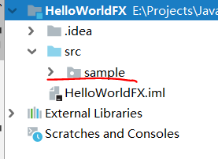
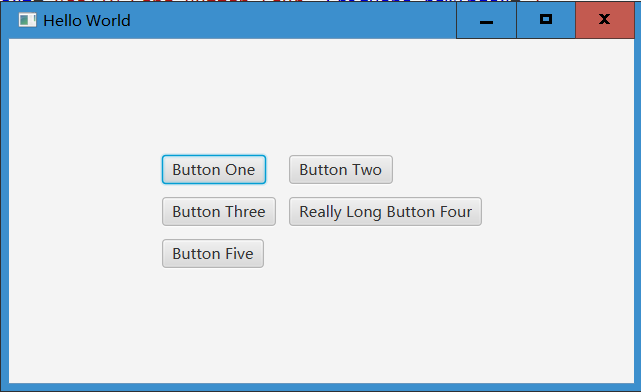
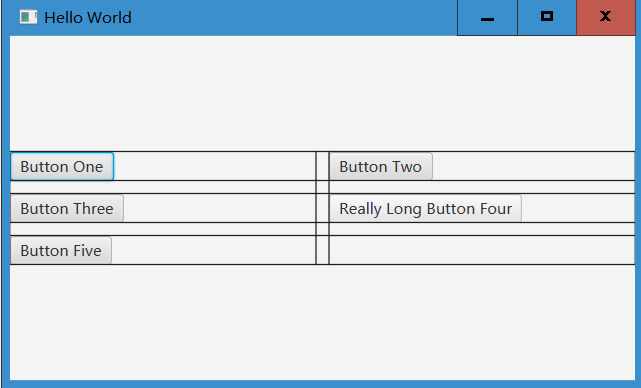
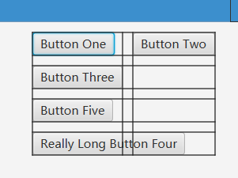
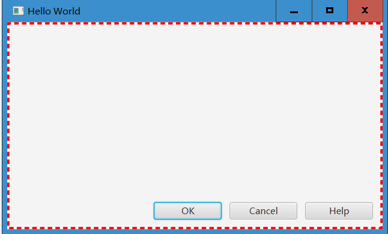
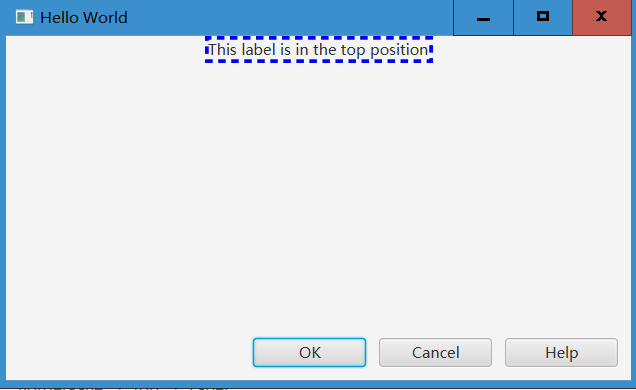
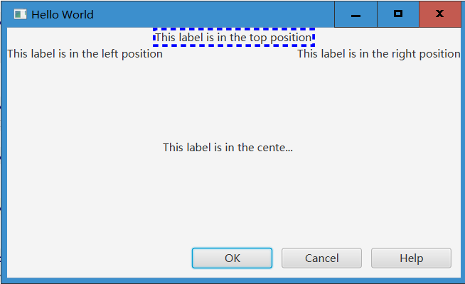
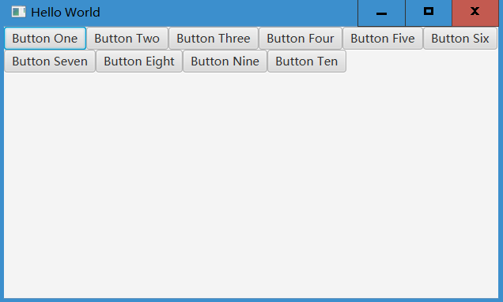

#### Download JavaFX for JDK 11

https://gluonhq.com/products/javafx/

Download 'JavaFX Windows SDK'. 把它放到一个文件夹，以后要从这引用。

IntelliJ IDEA > Configure > Project Defaults > Project Structure > Global Libraries > + > Java

Select all .jar files then click OK. Change the name, like 'JavaFX-11'.


#### First JavaFX

**每次创建新项目后：**

1. 右键单击项目文件夹，open module settings;

2. 确认 Project language level 是 11；

3. 确认 Moudles 里面 Language level 也是 11;

4. 在 Global Libraries 里，右键点击上一步引入的 JavaFX-11 > Add to Modules...

5. Right click the source fold (src) > new > module-info.java:

   ```java
   module HelloWorldFX {
       requires javafx.fxml;
       requires javafx.controls;
       
       opens sample; // the package name
   }
   ```




Sample is the package name. After this click 'run-main'.


#### JavaFX Overview

JavaFX was designed with the MVC pattern in mind. When working with it, the model corresponds to the application's data model, the view is the FXML, and the controller is the code that determines what happens when a user interacts with the UI.

```xml
<GridPane fx:controller="sample.Controller"
          xmlns:fx="http://javafx.com/fxml" alignment="center" hgap="10" vgap="10">
</GridPane>
```

fx: controller="sample.Controller" point out the controller.


#### Hello World Project

**Label**

```xml
<GridPane fx:controller="sample.Controller"
          xmlns:fx="http://javafx.com/fxml" alignment="center" hgap="10" vgap="10">
    <Label text="Welcome to JavaFX" textFill="green">
        <font>
            <Font name="Times New Roman bold" size="70" />
        </font>
    </Label>
</GridPane>
```

textFill -> Font Color


#### GridPane Layout

**preferred size:** the height and weight

```xml
<GridPane fx:controller="sample.Controller"
          xmlns:fx="http://javafx.com/fxml" alignment="center" hgap="10" vgap="10">
    <Button text="Button One" GridPane.rowIndex="0" GridPane.columnIndex="0" />
    <Button text="Button Two" GridPane.rowIndex="0" GridPane.columnIndex="1" />
    <Button text="Button Three" GridPane.rowIndex="1" GridPane.columnIndex="0" />
    <Button text="Really Long Button Four" GridPane.rowIndex="1" GridPane.columnIndex="1" />
    <Button text="Button Five" GridPane.rowIndex="2" GridPane.columnIndex="0" />
</GridPane>
```



Adding gridLinesVisible="true" to GridPane shows the lines. It is easy to confirm the size of rows and columns.

**Add column constraints before button one**

```xml
<columnConstraints>
    <ColumnConstraints percentWidth="50.0" />
    <ColumnConstraints percentWidth="50.0" />
</columnConstraints>
```




#### HBox Layout

```xml
<GridPane fx:controller="sample.Controller"
          xmlns:fx="http://javafx.com/fxml" alignment="top_center" hgap="10" vgap="10"
          gridLinesVisible="true">
    <padding>
        <Insets top="10" />
    </padding>
    <Button text="Button One" GridPane.rowIndex="0" GridPane.columnIndex="0" />
    <Button text="Button Two" GridPane.rowIndex="0" GridPane.columnIndex="1" />
    <Button text="Button Three" GridPane.rowIndex="1" GridPane.columnIndex="0" />
    <Button text="Really Long Button Four" GridPane.rowIndex="3" GridPane.columnIndex="0" GridPane.columnSpan="2" />
    <Button text="Button Five" GridPane.rowIndex="2" GridPane.columnIndex="0" />
</GridPane>
```





```xml
<HBox fx:controller="sample.Controller"
      xmlns:fx="http://javafx.com/fxml" alignment="bottom_right"
        style="-fx-border-color: red; -fx-border-width: 3; -fx-border-style: dashed"
        spacing="10">
    <padding>
        <Insets bottom="10" right="10" />
    </padding>
    <Button text="OK" prefWidth="90" />
    <Button text="Cancel" prefWidth="90" />
    <Button text="Help" prefWidth="90" />

</HBox>
```



Spacing sets the spaces between buttons.


#### BorderPane Layout

```xml
<BorderPane fx:controller="sample.Controller"
            xmlns:fx="http://javafx.com/fxml">
    <top>
        <Label text="This label is in the top position" alignment="center"
                BorderPane.alignment="center"
               style="-fx-border-color: blue; -fx-border-width: 3; -fx-border-style: dashed"/>
    </top>
    <bottom>
        <HBox spacing="10" alignment="bottom_right">
            <padding>
                <Insets bottom="10" right="10" />
            </padding>
            <Button text="OK" prefWidth="90" />
            <Button text="Cancel" prefWidth="90" />
            <Button text="Help" prefWidth="90" />

        </HBox>
    </bottom>

</BorderPane>
```




```xml
<BorderPane fx:controller="sample.Controller"
            xmlns:fx="http://javafx.com/fxml">
    <top>
        <Label text="This label is in the top position" alignment="center"
                BorderPane.alignment="center"
               style="-fx-border-color: blue; -fx-border-width: 3; -fx-border-style: dashed"/>
    </top>
    <center>
        <Label text="This label is in the center position and has really looooooooooooooooooooong text" />
    </center>
    <left>
        <Label text="This label is in the left position" alignment="center" />
    </left>
    <right>
        <Label  text="This label is in the right position" />
    </right>
    <bottom>
        <HBox spacing="10" alignment="bottom_right">
            <padding>
                <Insets bottom="10" right="10" />
            </padding>
            <Button text="OK" prefWidth="90" />
            <Button text="Cancel" prefWidth="90" />
            <Button text="Help" prefWidth="90" />

        </HBox>
    </bottom>

</BorderPane>
```




#### Other Layout

```xml
<FlowPane fx:controller="sample.Controller"
          xmlns:fx="http://javafx.com/fxml" orientation="HORIZONTAL">
    <Button text="Button One" />
    <Button text="Button Two" />
    <Button text="Button Three" />
    <Button text="Button Four" />
    <Button text="Button Five" />
    <Button text="Button Six" />
    <Button text="Button Seven" />
    <Button text="Button Eight" />
    <Button text="Button Nine" />
    <Button text="Button Ten" />
</FlowPane>
```



**Tile Pane, Stack Pane**


